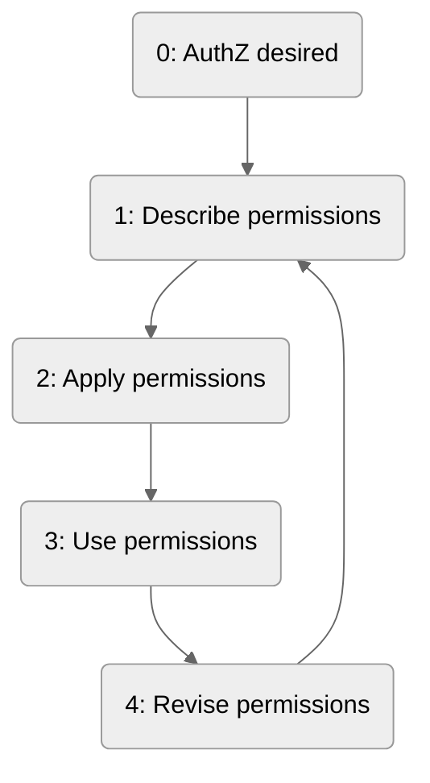

# RFC: The permissions lifecycle for platform tools will be managed via version control

* Comment Deadline: `2022-07-15`
* Team Crew and Name: [Platform/Access Management Team](https://dsva.slack.com/archives/C02GQ27HXQW)
* Authors:
  * [Kevin Duensing](https://github.com/kjduensing)
* [Original RFC Pull Request](https://github.com/department-of-veterans-affairs/va.gov-platform-architecture/pull/26)

## Background
In order to fully leverage the powerful authorization services of Keycloak, the platform tool integrated into Keycloak must be configured with a set of permissions. Permissions are composed of roles, resources, scopes, policies, and various other attributes. AMT has recommended a format and schema for defining these permissions[[RFC6]](https://vfs.atlassian.net/wiki/spaces/AMT/pages/2142011842/RFC+6+AMT+integrators+can+describe+fine-grained+permissions+using+JSON).

Currently, no holistic process has been defined to direct the flow from permissions generation to permissions integration. The intent of this RFC is to gather feedback and criticism of a proposed process for managing the lifecycle of permissions of a platform tool.

## Motivation
Though AMT has defined a schema for describing permissions, there is no prescribed process for the managing the lifecycle of a platform tool's permissions. Because of the lack of a permissions lifecycle management process, integrations with Keycloak have led to lengthy manual integrations. Defining and implementing a process using existing and popular tooling will reduce confusion, streamline the process, and pave the way for automation opportunities in the near future. 

## Design

### 0: Authorization Desired 
This step handles the cases:
1. The application has not been integrated into Keycloak
2. The application has [been integrated into Keycloak](https://vfs.atlassian.net/wiki/spaces/AMT/pages/2088402974/Integrate+a+User-facing+Application+with+Keycloak), but has not configured authorization

_Note: Currently, applications within Keycloak are identified manually. Similarly, permissions requests will be verified to come from the appropriate team manually. However, there is some potential for this to be automated, either by a) the CODEOWNERS file of the repo or b) the Platform Console. The effort required for automating verification using these tools is outside the scope of this RFC and can be described in a separate document._

### 1: Describe Permissions
This step encompasses the process of detailing a platform tool's permissions in JSON format[[RFC6]](https://vfs.atlassian.net/wiki/spaces/AMT/pages/2142011842/RFC+6+AMT+integrators+can+describe+fine-grained+permissions+using+JSON), including any support from AMT.

### 2: Apply Permissions
The permissions application step automatically applies the permissions configuration to the integrated platform tool upon merge of a pull request. The pull request will be reviewed by AMT for _general_ validity, but AMT cannot and does not know the specific configuration of each tool. This is described in more detail below.

### 3: Use Permissions
This step represents some amount of time where the integrated and configured platform tool's users interact with the tool under the scope of permissions they have been provided.

### 4: Revise Permissions
Revising permissions could occur when:
1. An authorization bug has been found and must be corrected
2. A role must permanently or temporarily promote or demote its access to resources
3. An endpoint/resource of a platform tool has been deprecated
4. A platform tool has been deprecated or phased out
   
### Source code process

```mermaid
%%{init: { 'theme':'neutral' } }%%
flowchart
    subgraph permissions_lifecycle[ ]
        direction LR
        subgraph ptt[Platform Tool Team]
            direction LR
            auth_needed(Authorization change needed)
            desc_perms(Describe permissions)
            pr(Pull Request)

            auth_needed --> desc_perms
            desc_perms --> pr
        end

        pr --> review
        
        subgraph amt[Access Management Team]
            direction LR
            review(Review PR)
            suggests{Suggestions?}
            approve(Approve PR)
            review --> suggests
            suggests --> |Yes| pr
            suggests --> |No| approve
            approve --> gen_tf

            subgraph auto[Automation]
                direction TB
                subgraph gha[Github Actions Workflow]
                    gen_tf[Generate TF config from perms.json] --> gha_pr(Create PR for TF config)
                end
                

                subgraph tf[Terraform/Keycloak]
                    tf_apply[Terraform apply] --> kc_client_updated[Keycloak client permissions updated]
                end
            end
           
            gha_pr --> amt_tf_review[AMT review]
            amt_tf_review --> suggests2{Suggestions?}
            suggests2 --> |No| merge[AMT merge]
            suggests2 --> |Yes| pr
            merge --> tf_apply
      end
    end
```

## Risks
Adding permissions in plain text (JSON) format to a repo has some security implications. A malicious actor could see and potentially do harm with role, resource, and scope information if they were given access to the Github organization.

## Alternatives
Instead of committing permissions information to source control, we could store this information in a document database, e.g. AWS DocumentDB. A database like this would be a good fit for JSON data, thus continuing to provide a common and schematized format for users. It adds the additional benefit of not storing permissions in plain text by offering (electable) encryption at rest for a DocDB cluster.

## References
* [RFC 6](https://github.com/department-of-veterans-affairs/va.gov-platform-arch/blob/<FULL_COMMIT_HASH>/rfc/<FILENAME>.md): AMT integrators can describe fine-grained permissions using JSON
