# RFC: The permissions lifecycle for platform tools will be managed via version control

<!--
The title is what you want comments on. Use the active voice in a future tense.
Example:
    - The website will be built using the XZY framework
-->

* Comment Deadline: `2022-06-15`
* Team Crew and Name: [Platform/Access Management Team](https://dsva.slack.com/archives/C02GQ27HXQW)
* Authors:
  * [Kevin Duensing](https://github.com/kjduensing)
* [Original RFC Pull Request](https://github.com/department-of-veterans-affairs/va.gov-platform-arch/pull/-1)

## Background
In order to fully leverage the powerful authorization services of Keycloak, the platform tool integrated into Keycloak must be configured with a set of permissions. Permissions are composed of roles, resources, scopes, policies, and various other attributes. AMT has recommended a format and schema for defining these permissions[[RFC6]](https://vfs.atlassian.net/wiki/spaces/AMT/pages/2142011842/RFC+6+AMT+integrators+can+describe+fine-grained+permissions+using+JSON).

Currently, no holistic process has been defined to direct the flow from permissions generation to permissions integration. The intent of this RFC is to gather feedback and criticism of a proposed process for managing the lifecycle of permissions of a platform tool.

## Motivation
Though AMT has defined a schema for describing permissions, t1xhere is no prescribed process for the managing the lifecycle of a platform tool's permissions. Because of the lack of a permissions lifecycle management process, integrations with Keycloak have led to lengthy manual integrations. Defining and implementing a process using existing and popular tooling will reduce confusion, streamline the process, and pave the way for automation opportunities in the near future. 

## Design
test

```mermaid
%%{init: { 'theme':'neutral' } }%%
flowchart
    subgraph permissions_lifecycle[ ]
        direction LR
        subgraph ptt[Platform Tool Team]
            direction LR
            auth_needed(Authorization change needed)
            desc_perms(Describe permissions)
            pr(Pull Request)

            auth_needed --> desc_perms
            desc_perms --> pr
        end

        pr --> review
        
        subgraph amt[Access Management Team]
            direction LR
            review(Review PR)
            suggests{Suggestions?}
            approve(Approve PR)
            review --> suggests
            suggests --> |Yes| pr
            suggests --> |No| approve
            approve --> gen_tf

            subgraph auto[Automation]
                direction TB
                subgraph gha[Github Actions Workflow]
                    gen_tf[Generate TF config from perms.json] --> gha_pr(Create PR for TF config)
                end
                

                subgraph tf[Terraform/Keycloak]
                    tf_apply[Terraform apply] --> kc_client_updated[Keycloak client permissions updated]
                end
            end
           
            gha_pr --> amt_tf_review[AMT review]
            amt_tf_review --> suggests2{Suggestions?}
            suggests2 --> |No| merge[AMT merge]
            suggests2 --> |Yes| pr
            merge --> tf_apply
      end
    end
```

## Risks

List the risks of this approach

* There are always risks. What are the risks of this solution?
* These are the things people will bring up in opposition to your idea or plans. Acknowledge them.

## Alternatives

List the alternative approaches

* There are always alternatives. What other alternative solutions were considered? Not considered?
* What are their strengths, weaknesses, risks? Why weren’t they chosen?
* Do not allow bias of a solution to show in this section, ensure each alternative has been considering seriously or do not list it in this section

## References
* [RFC 6](https://github.com/department-of-veterans-affairs/va.gov-platform-arch/blob/<FULL_COMMIT_HASH>/rfc/<FILENAME>.md): AMT integrators can describe fine-grained permissions using JSON
