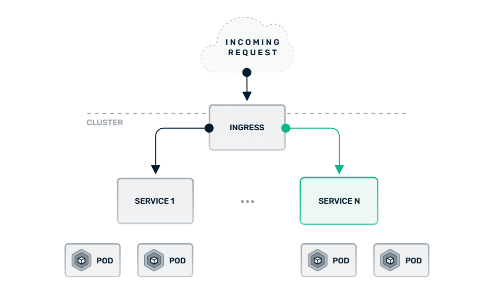
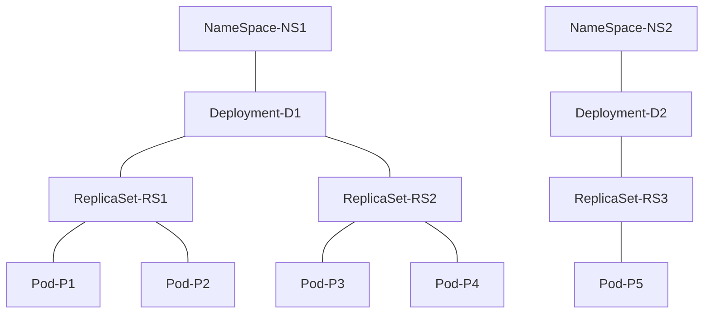
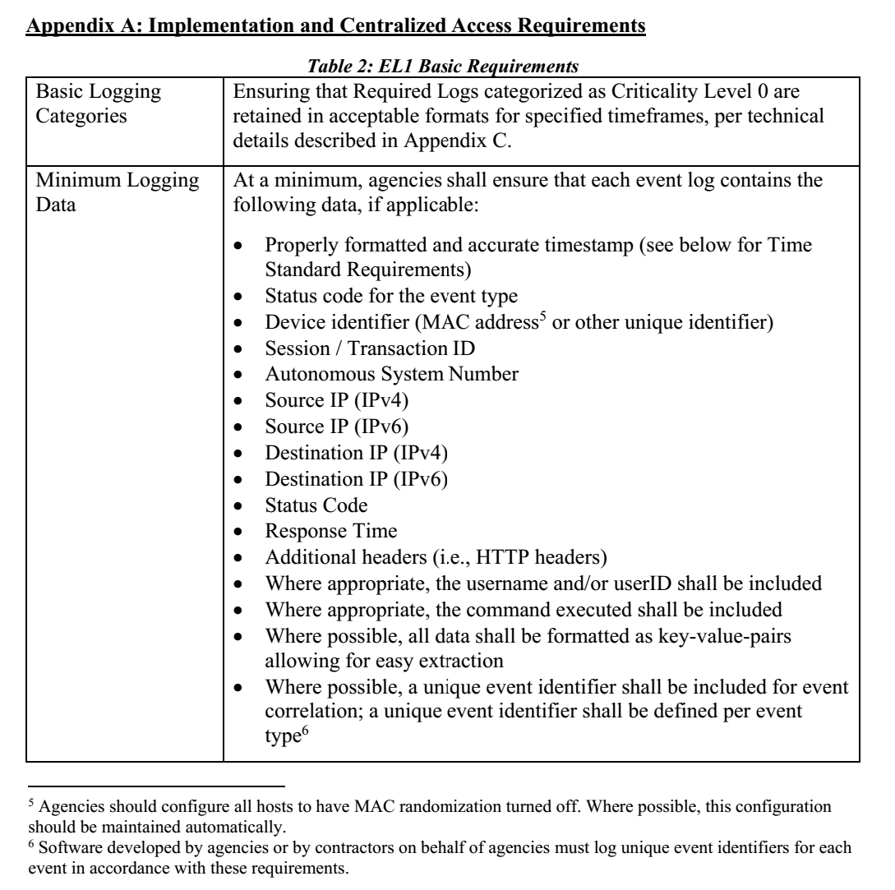
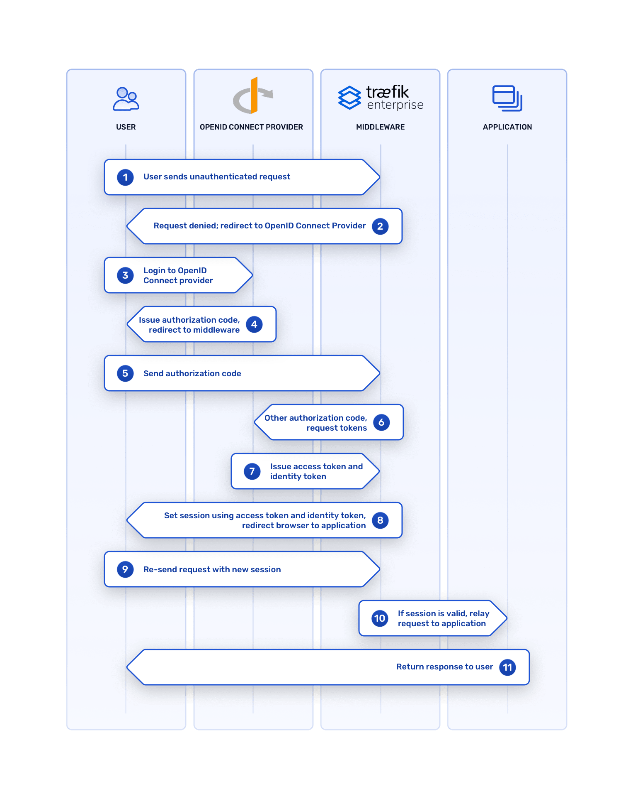

# IET RFC 002: TraefikEE + Keycloak SSO on Kubernetes Ingress

This document explains why:

1. Authentication and authorization for microservices should be done on the Kubernetes ingress controller.  
2. A mature solution with enterprise support such as Traefik Enterprise Edition should be used.  
3. We should make this solution available for development teams early in the microservices lifecycle. 

Details
  
* Comment Deadline: `2022-07-14`  
* Team Crew and Name: Platform/Spike - Integration Experience Team   
* Authors: 
  * [Igor Yegorov](https://github.com/considerable)  
  * [Emily Wilson](https://github.com/ewilson-adhoc)  
* [Original RFC Pull Request](https://github.com/department-of-veterans-affairs/va.gov-platform-architecture/pull/25)  

## Background

> Explain the current state. What is the problem? What needs to happen? Provide enough background for someone new to the problem space to understand this decision. Use active voice, present tense, and decisive language.
Example: We need to choose how the website will render in the browser. There are several competing frameworks to choose from.

In the current state, Platform operating environments are moving into Amazon Elastic Kubernetes Service (EKS) or simply Kubernetes. At the same time, Login.gov single sign-on (SSO) is being introduced for Platform access management with Keycloak software as a broker. Login.gov is one of the many parts of Zero Trust Architecture (ZTA). ZTA involves Cyber-Secure Policy Enforcement Points (PEPs).

The task at hands is, first, to decide where is the best place for PEP (on the Application container level within a pod, on the Sidecar level in front of the Application within same pod, on the Kubernetes ingress level in front of the whole Kubernetes cluster), second, implement selected PEP solution to protect all applications in the Kubernetes cluster.     

### Kubernetes 1.0.1 - Ingress Controller

The Ingress resource can expose multiple underlying Services through a single external endpoint or load balancer. Administrators can specify how traffic should be routed to defined Service resources using, for example, host or prefix rules. Together, Ingress and Service resources provide a flexible mechanism for enabling external access to applications.



On its own, an Ingress resource simply conveys a request for networking configuration. A separate component known as an **ingress controller** is responsible for consuming these requests and creating the corresponding routes in a technology-specific manner. There are many potential options available, but a few examples include:

- **Traefik Proxy.** An open source reverse proxy and endpoint router that can function as a Kubernetes Ingress controller, curently maintained by Platform Infrastructure Team.
- **AWS ALB.** An ingress controller offered by Amazon AWS and AWS GovCloud-US; it satisfies inbound ingress resource requests using AWS Application Load Balancers. 
- **NGINX.** Implements Ingress resources using the NGINX open source web server and load balancer software. 
- **HAProxy.** Implements Ingress resources using the HAProxy open source web server and load balancer software.

**_Note:_** Kubernetes administrators have the flexibility to deploy multiple ingress controllers if desired, based upon their specific needs and requirements.

Another role for Kubernetes ingress controllers is controlling access to services and applications on the cluster. This involves two distinct, but closely related functions:

- Authentication establishes the identity of the entity making the request. 
- Authorization determines whether an authenticated entity is allowed to do what it asks to do.

By delegating this function to the ingress controller, all services exposed in the Kubernetes cluster gain the benefits of authentication management without incurring the complexity at the individual service layer. Modern authentication methods can even be added to applications on a cluster without modifying any application code.

### Traefik 1.0.1 - Reverse Proxy and Load Balancer

Traefik is modern reverse proxy and load balancer that makes deploying microservices easy. Traefik intercepts and routes every incoming request to the corresponding backend services. Unlike a traditional, statically configured reverse proxy, Traefik uses service discovery to configure itself dynamically from the services themselves. All major protocols are supported and can be flexibly managed with a rich set of configurable middlewares for load balancing, rate-limiting, circuit-breakers, mirroring, authentication, and more.
Traefik also supports SSL termination and can be used with an ACME provider (like Let’s Encrypt) for automatic certificate generation.  
 
Traefik Enterprise Edition (TraefikEE) is a commercial platform built on top of Traefik, designed for mission-critical deployments. TraefikEE authentication middleware for OpenID Connect (OIDC) is known to integrate with Keycloak server on the Kubernetes ingress level.

Traefik is a cloud-native application deployed as a [DaemonSet via ArgoCD](https://github.com/department-of-veterans-affairs/vsp-infra-application-manifests/blob/main/apps/vsp-operations/traefik/dev/values-dev.yaml), meaning Traefik daemon gets deployed to each worker node in the EKS cluster. It does capture all communications in the EKS cluster.
P1 and P2 are pods of the same replicaSet RS1 of the deployment D1 in the NameSpace NS1 (application NS1) while P3 and P4 a pods of another replicaSet RS2 of the same deployment D1 of NameSpace NS1 (same application NS1).
Most applications the teams deployed look like deployment D2 in Namespace NS2 (application NS2) with only one replicaSet RS3 and only one pod in it P5. The following mermaid diagram is best viewed in Chrome browser:



Being in different namespaces, pods of different applications don't talk to each other directly, their communication is routed via DNS first and then via Traefik, the ingress controller.

### Keycloak 1.0.1 - OIDC Identity Broker (IdB) and Identity Provider (IdP)

OpenID Connect (OIDC) is the third generation of OpenID technology. It is an authentication layer on top of the OAuth 2.0 authorization framework. It allows computing clients to verify the identity of an end user based on the authentication performed by an authorization server, as well as to obtain the basic profile information about the end user in an interoperable and REST-like manner. In technical terms, OIDC specifies a RESTful HTTP API, using JSON as a data format. OIDC also makes heavy use of the Json Web Token (JWT) set of standards. OIDC allows a range of parties, including web-based, mobile and JavaScript clients, to request and receive information about authenticated sessions and end users. 
  
Via OIDC, Keycloak can act in two capacities, as an Identity Broker (IdB) to LOGIN.GOV and an Identity Provider (IdP) of local user pool.   
Keycloak, by design, provides secure authentication and authorization for deployments that range from on-premise deployments that support a few thousand users to deployments that serve millions of users, which matches VA's workload of 50,000 veterans online per day. Keycloak service, maintained by Platform Access Management Team, runs in EKS clusters Dev and Utility (Dev-environment and Utility-environment). Keycloak supports OpenID Connect and is on the list of [Certified OpenID Provider Servers and Services](https://openid.net/developers/certified/).  

### Zero Trust Security Model 1.0.1 - Basic terms of ZTA

ZTA, the zero trust security model (also, zero trust architecture, zero trust network architecture, ZTA, ZTNA), sometimes known as perimeterless security, describes an approach to the design of IT systems. The main concept behind the zero trust security model is "never trust, always verify", which means that devices should not be trusted by default, even if they are connected to a permissioned network such as a corporate LAN and even if they were previously verified. The reasoning for zero trust is that the traditional approach - trusting devices within a notional "corporate perimeter", or devices connected via a VPN - is not relevant any more in the modern complex network environment.

ZTA involves Cyber-Secure Policy Enforcement Points (PEPs). PEP is a system responsible for enabling, monitoring, and terminating connections between a subject and an enterprise resource. Keycloak integration is a PEP example.

ZTA in general is defined in these public documents:

- https://www.whitehouse.gov/wp-content/uploads/2022/01/M-22-09.pdf
- https://nvlpubs.nist.gov/nistpubs/SpecialPublications/NIST.SP.800-207.pdf

ZTA includes expectation for "EL1 level of logging maturity" by August 27, 2022:

- https://www.whitehouse.gov/wp-content/uploads/2021/08/M-21-31-Improving-the-Federal-Governments-Investigative-and-Remediation-Capabilities-Related-to-Cybersecurity-Incidents.pdf



## Motivation

> Which problem(s) does this solve? Why? Use active voice, present tense, and decisive language.
Example: Framework XYZ is a modern, well-known, web rendering framework. It is easy to learn, easy to use, and provides high-performance web rendering. etc

**What is the problem to solve?**

Current requirements demand to deploy a single sign-on integration with Login.gov, and a central log aggregation system of EL1 maturity level, and revisit the whole system design to align it with Zero Trust security model. Traefik Enterprise Edition authentication middleware for OpenID Connect integration with Keycloak server will solve both problems, Login.gov single sign-on and EL1 maturity level logging, on the Kubernetes ingress level.

**Why Traefik Enterprise Edition?**

Traefik Enterprise is a flexible ingress and API gateway that solves a variety of networking challenges in the cloud native stack. One of the most common reasons users opt for the enterprise version of Traefik Proxy is to take advantage of the suite of authentication middlewares. Of these, the OpenID Connect (OIDC) middleware is an increasingly prevalent choice.

The **OIDC middleware in Traefik Enterprise** is also powerful in part because of its flexibility. With it, users can delegate authentication to any Identity Provider (IdP) that follows the OIDC standard, think **Keycloak**, to:

1. Load balance any applications and easily scale out to meet production traffic needs
2. Secure services with end-to-end network and application encryption
3. Provide end-to-end monitoring and real-time tracing for better insight into application uptime and performance

VA's workload of 50,000 veterans online per day demands a strong vendor in OIDC field to back it with enterprise-grade support.

**When to do this?**

An upgrage like this fits at the beginning of the development circle to support ongoing operations with production-grade infrastructure.

## Design

> Explain the proposed design in enough detail so that a team member will fully understand the implementation. Include a diagram (in the `images` dir) as needed to convey your plans. Use active voice, present tense, and decisive language.

The OpenID Connect Authentication middleware secures your applications by delegating the authentication to an external provider (Google Accounts, GitHub, Keycloak, etc.) and obtaining the end user's session claims and scopes for authorization purposes.

On the below diagram Keycloak is abstracted as OpenID Connect Provider:



In the design above the OIDC implementation is shifted  towards networking and infrastructure operations.

For DevOps community leaning more towards application development, this blog article from OKTA explains the steps in greater details - [An Illustrated Guide to OAuth and OpenID Connect](https://developer.okta.com/blog/2019/10/21/illustrated-guide-to-oauth-and-oidc)

For summary, the complexity of OIDC is high enough to offload it from the application and microservices development teams and choose an enterprise-grade implementation on the network entry point, i.e. TraefikEE on Kubernetes ingress.


## Hello World

**Anatomy of a sample API call in a POC local Docker setup**

```
curl -s http://traefikee-test.vsp.local/whoami
```
Produces this output
  
``` 
Hostname: 787b3b7c7cf4
IP: 127.0.0.1
IP: 10.0.2.6
IP: 192.168.144.8
RemoteAddr: 10.0.2.3:48336
GET /whoami HTTP/1.1
Host: traefikee-test.vsp.local
User-Agent: curl/7.79.1
Accept: */*
Accept-Encoding: gzip
X-Forwarded-For: 10.0.0.2
X-Forwarded-Host: traefikee-test.vsp.local
X-Forwarded-Port: 80
X-Forwarded-Proto: http
X-Forwarded-Server: b131c38ab00c
X-Real-Ip: 10.0.0.2
```

Access log entry of this call produced by TraefikEE looks pretty close to ZTA logging maturity requirements right out of the box:

```json
{
  "ClientAddr": "10.0.0.2:57398",
  "ClientHost": "10.0.0.2",
  "ClientPort": "57398",
  "ClientUsername": "-",
  "DownstreamContentSize": 385,
  "DownstreamStatus": 200,
  "Duration": 5386497,
  "OriginContentSize": 385,
  "OriginDuration": 5241769,
  "OriginStatus": 200,
  "Overhead": 144728,
  "RequestAddr": "traefikee-test.vsp.local",
  "RequestContentSize": 0,
  "RequestCount": 7,
  "RequestHost": "traefikee-test.vsp.local",
  "RequestMethod": "GET",
  "RequestPath": "/whoami",
  "RequestPort": "-",
  "RequestProtocol": "HTTP/1.1",
  "RequestScheme": "http",
  "RetryAttempts": 0,
  "RouterName": "whoami@docker",
  "ServiceAddr": "10.0.2.6:80",
  "ServiceName": "whoami@docker",
  "ServiceURL": {
    "Scheme": "http",
    "Opaque": "",
    "User": null,
    "Host": "10.0.2.6:80",
    "Path": "",
    "RawPath": "",
    "ForceQuery": false,
    "RawQuery": "",
    "Fragment": "",
    "RawFragment": ""
  },
  "StartLocal": "2022-06-11T00:18:24.95226167Z",
  "StartUTC": "2022-06-11T00:18:24.95226167Z",
  "entryPointName": "web",
  "level": "info",
  "msg": "",
  "time": "2022-06-11T00:18:24Z"
}
```

## Risks

> List the risks of this approach  
> * There are always risks. What are the risks of this solution?  
> * These are the things people will bring up in opposition to your idea or plans. Acknowledge them.  

One concern we heard is what if someone deploys an application without baked in-app Keycloak integration and also skips Keycloak integration on the network level? 

To control this kind of risk of not following the established practices, it might be good to look at how our deployment workflow is enforced.

Another risk is what if the system capacity will not be sufficient to meet the production workloads?

To control the kind of performance saturation risk, it is good to have an experienced vendor, think Traefik Labs, to support our OIDC integration starting from the trial period and system design time following through the production monitoring and necessary upgrades or patches over time. 

Approximate load considerations:

* We don't know yet for sure what the load on the OpenID-Connect (TraefikEE-to-Keycloak) would be, so it is good to have a vendor for enterprise-grade support, such as Traefik Labs.
* We are targeting the new version of VETS-API that is coming to EKS, in some part as monolith, in some part as a collection of microserviecs. 
* In the new system, in the spirit of ZTA, we expect some auth & authz activities between the microservices every time a user comes in with a new session plus a possibility of scheduled API calls w/o a user. 

IET in-house research of the production monolith VETS-API can be found [here](https://docs.google.com/spreadsheets/d/14iNeWOyaMe0aqVtgfCqTE7cl3xAfQ7YJDsjRbADOXCk/edit#gid=1482742543). If you have no access to that google doc, here is the data sampling from Grafana, which might have some Lighthouse activities mixed in.

Top 10 endpoints as of Winter 2022 sampling:

|Daily Hits|Ruby Rails Controller (Winter workday 2022)
|:--       |:-- 
|28,393,133|openid_auth/v2/validation
|5,707,644 |v0/feature_toggles
|1,177,183 |v0/users
|846,537	 |v1/sessions
|581,374	 |v0/backend_statuses
|467,941	 |v0/evss_claims\_async
|354,112	 |v0/disability_compensation\_in\_progress\_forms
|277,237	 |v0/maintenance_windows
|239,064	 |v0/in_progress\_forms
|215,398	 |v0/search_typeahead

Top 10 endpoints as of Summer 2022 sampling:

|Daily Hits|Ruby Rails Controller (Summer weekend 2022)
|:--       |:-- 
|3,707,087 |openid_auth/v2/validation
|1,571,110 |v0/feature_toggles
|480,614	 |v0/backend_statuses
|404,328	 |v0/users
|205,859	 |v1/sessions
|151,986	 |v0/evss_claims\_async
|126,369	 |v0/disability_compensation\_in\_progress\_forms
|107,309	 |mobile/v0/claims_and\_appeals
|97,532	 |v0/in_progress\_forms
|88,327	 |mobile/v0/disability_rating
|74,807	 |v0/maintenance_windows

Veterans will not auth directly, but the number of veterans online (600k registered veterans with 50k logging in daily) might indicate the load level on the microservices and the software-to-software auth activities hapining behind the scene.


## Alternatives

> List the alternative approaches  
> * There are always alternatives. What other alternative solutions were considered? Not considered?  
> * What are their strengths, weaknesses, risks? Why weren’t they chosen?  
> * Do not allow bias of a solution to show in this section, ensure each alternative has been considering seriously or do not list it in this section

1. [OIDC with Keyckloack and Target App with Gatekeeper sidecar](https://github.com/department-of-veterans-affairs/vets-api-file-upload/blob/main/oidc-poc/README.md)
    - Strengths: [Gatekeeper](https://github.com/gogatekeeper/gatekeeper) is a mature sidecar software project that can be used in front of any microservice
    - Weaknesses: moderately hard to manage how each team would use this sidecar for their microservice 
    - Risks: Gatekeeper is not a very big open sources project 
    - Why not chosen: Gatekeeper is second best after TraefikEE  
2. [OIDC with Keyckloack baked into Application](https://github.com/department-of-veterans-affairs/vets-api-sidekiq-ui/blob/43a79ac30428290f6920e3a95c1b3d312984b6fa/app/config.ru#L32)
    - Strengths: full control of the implementation baked in the app by Platform own developers
    - Weaknesses: requires to maintain the skill in every team, complicates security audit and change managenet
    - Risks: every team to strart coding it would lack the maturity of existing tried and tested implementations
    - Why not chosen: third best after TraefikEE or Gatekeeper

## References

* [TraefikEE blog](https://traefik.io/blog/testing-oidc-authentication-traefik-enterprise/): Bench Testing OpenID Connect Authentication in Traefik Enterprise
* [RFC 2020-01-17 - SSO Symmetry and Identifiers
](https://github.com/department-of-veterans-affairs/va.gov-platform-architecture/blob/main/rfc/2020/2020-01-17%20-%20SSO%20Symmetry%20and%20Identifiers.md): Another RFC related to SSO
* [RFC Template](https://github.com/department-of-veterans-affairs/va.gov-platform-architecture/blob/main/rfc/_template.md): How to put an RFC together

