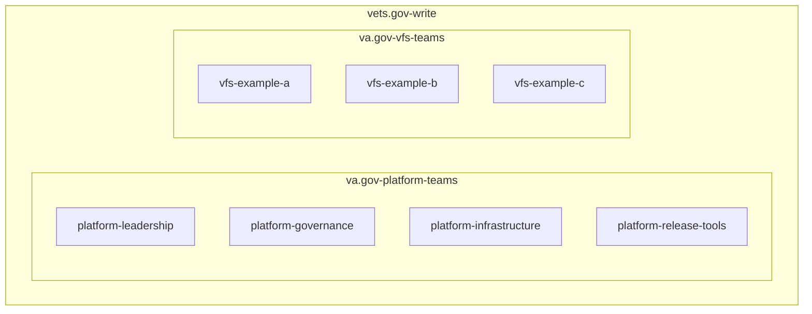
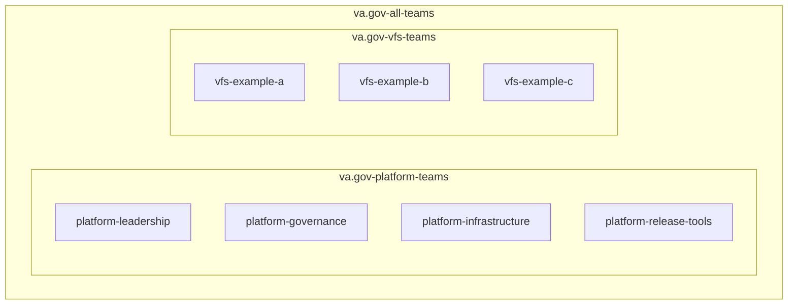

# RFC: Github Access for Platform and VFS will be managed by nested Teams

<!--
The title is what you want comments on. Use the active voice in a future tense.
Example:
    - The website will be built using the XZY framework
-->

* Comment Deadline: `YYYY-MM-DD`
* Team Crew and Name: Platform/Leadership
* Authors:
  * @mchelen-gov
  * [Contributing Author 1 Github Handle](https://github.com/ContributingAuthor1Handle)
  * [Contributing Author 2 Github Handle](https://github.com/ContributingAuthor2Handle)
* [Original RFC Pull Request](https://github.com/department-of-veterans-affairs/va.gov-platform-arch/pull/-1)

## Background

Currently permissions to repos such as va.gov-team, vets-website, and vets-api are largely handled through the `vets.gov-write` [team](https://github.com/orgs/department-of-veterans-affairs/teams/vets-gov-write). This team includes a mixture of individual [members](https://github.com/orgs/department-of-veterans-affairs/teams/vets-gov-write/members) as well as [child teams](https://github.com/orgs/department-of-veterans-affairs/teams/vets-gov-write/teams).

This makes management of users and permissions difficult for multiple reasons:
1. The roles of various individual users added to the `vets.gov-write` team are unclear and difficult to track.
1. Onboarding and offboarding of individual users has to be performed by maintainers of `vets.gov-write` creating maintainence burden.
1. Refined permissions cannot be applied to various level groupings such as "all Platform teams" or "all VFS teams"

We need to restructure our Github Teams to improve clarity, reduce manual overhead, and increase granularity of permissions.

## Motivation

Which problem(s) does this solve? Why? Use active voice, present tense, and decisive language.
Example: Framework XYZ is a modern, well-known, web rendering framework. It is easy to learn, easy to use, and provides high-performance web rendering. etc

## Design

Explain the proposed design in enough detail so that a team member will fully understand the implementation. Include a diagram (in the `images` dir) as needed to convey your plans. Use active voice, present tense, and decisive language.

### Phase 1 - Establish structure

First, use the existing `vets.gov-write` team and ensure all users are represented in a child team.

### Phase 2 - Refine permissions

- Add any Platform specific permissions to `va.gov-platform-teams`
- and `va.gov-vfs-teams` that are needed.

### Phase 3

## Risks

List the risks of this approach

* There are always risks. What are the risks of this solution?
* These are the things people will bring up in opposition to your idea or plans. Acknowledge them.

## Alternatives

List the alternative approaches

* There are always alternatives. What other alternative solutions were considered? Not considered?
* What are their strengths, weaknesses, risks? Why weren’t they chosen?
* Do not allow bias of a solution to show in this section, ensure each alternative has been considering seriously or do not list it in this section

## Diagrams

## References

<!--
This section /may/ be eliminated if it is not applicable.
When linking to other documents in this repository, ensure to link to their state at a particular commit (hence the usage of .../blob/<FULL_COMMIT_HASH>/...) as opposed to their current state (i.e. 'currently in main').
-->

* [RFC XYZ](https://github.com/department-of-veterans-affairs/va.gov-platform-arch/blob/<FULL_COMMIT_HASH>/rfc/<FILENAME>.md): <RFC_TITLE>

