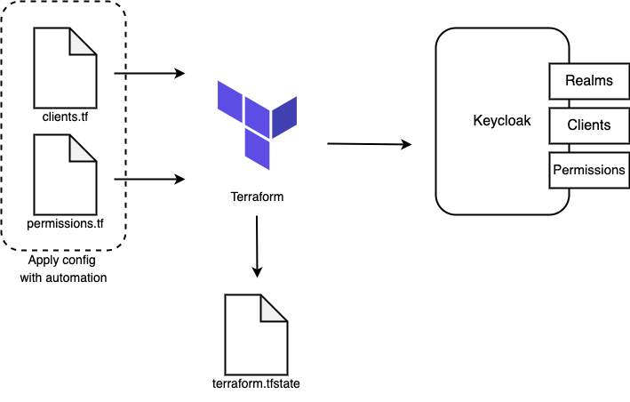

# RFC: Keycloak configuration will be managed by Terraform to support automation 

<!--
The title is what you want comments on. Use the active voice in a future tense.
Example:
    - The website will be built using the XZY framework
-->

* Comment Deadline: `2022-06-15`
* Team Crew and Name: Platform/Access Management Team
* Authors:
  * [Ritesh Patel](https://github.com/iriteshp)
  * [Kevin Duensing](https://github.com/kjduensing)

## Background
The Infrastructure as Code (IaC) is managing and provisioning the infrastructure as a code instead of doing it manually. Configurations are created as a code containing specifications of resources, which makes it easier to create, update, manage and distribute the configurations. There are several IaC solutions available currently but we will implement Terraform as IaC to configure Keycloak resources automatically because it is cloud-agnostic and provides a flexible abstraction of resources and providers

## Motivation
1. To make the process of creating/managing Keycloak resources automated so less manual intervention is needed.
2. To maintain user permissions automatically so human errors can be prevented and permissions can be audited in one place.
3. To ensure consistency so resource conflicts can be prevented. Terraform maintains one state so developers can reference the same configurations no matter where they are running from.

## Design
The syntax of Terraform configurations is called HashiCorp Configuration Language (HCL). The HCL config files contain configuration code for the Keycloak provider and resources. The diagram below describes our process for  The below process is a potential solution for automating Terraform to create/modify resources in Keycloak.

1. Pull requests in source control trigger automation with appropriate parameters and the parameters are passed to the config files. We will use commands terraform validate and terraform plan to validate configuration files and see the execution plan of the changes.
2. We will store state files generated by Terraform terraform.tfstate remotely maintains the state of infrastructure and configuration. 
3. After validating the execution plan when a pull request is approved, the process will trigger the terraform apply  command to execute proposed actions in the execution plan and apply changes in Keycloak.



Below are a few examples of Terraform configuration language (HCL) and how Keycloak configurations are maintained in config files.

Example of connecting Terraform to Keycloak server using the client credentials:

```hcl
provider "keycloak" {
  client_id     = "terraform"
  client_secret = "884e0f95-0f42-4a63-9b1f-94274655669e"
  url           = "http://localhost:8080"
}
```

Example of creating a client (clients.tf):
```hcl
resource "keycloak_realm" "realm" {
  realm   = "my-realm"
  enabled = true
}

resource "keycloak_openid_client" "openid_client" {
  realm_id            = keycloak_realm.realm.id
  client_id           = "test-client"

  name                = "test client"
  enabled             = true

  access_type         = "CONFIDENTIAL"
  valid_redirect_uris = [
    "http://localhost:8080/openid-callback"
  ]

  login_theme = "keycloak"

  extra_config = {
    "key1" = "value1"
    "key2" = "value2"
  }
}
```

Example of creating user permissions in Keycloak (permissions.tf):
```hcl
resource "keycloak_users_permissions" "users_permissions" {
  realm_id = keycloak_realm.realm.id

  view_scope {
    policies          = [
      keycloak_openid_client_user_policy.test.id
    ]
    description       = "description"
    decision_strategy = "UNANIMOUS"
  }

  manage_scope {
    policies          = [
      keycloak_openid_client_user_policy.test.id
    ]
    description       = "description"
    decision_strategy = "UNANIMOUS"
  }

  map_roles_scope {
    policies          = [
      keycloak_openid_client_user_policy.test.id
    ]
    description       = "description"
    decision_strategy = "UNANIMOUS"
  }
}
```
## Risks
A risk of using terraform is if the developer misconfigures terraform modules which could lead to deploying resources with security vulnerabilities inadvertently. Prevention of misconfiguration must be a significant part of the development. This issue could be avoided if there is constant and increased security scanning of Terraform modules and developers upgraded Terraform’s latest module versions with security patches.

## Alternatives
Like other tools, there are several other alternatives to terraform implementing infrastructure as code (IaC) with tools like CloudFormation (an AWS service) and Ansible.

CloudFormation is managed AWS service. It uses similar configuration files to set up infrastructure and deploys only via AWS. It also has limited third-party provider support and only works with a single provider, unlike Terraform.

Ansible is an open-source configuration management tool. it is also capable of provisioning the cloud resources but it is not comprehensive enough compare to Terraform.
