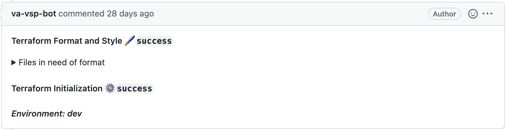

# RFC: Keycloak Terraform Pipeline 

<!--
The title is what you want comments on. Use the active voice in a future tense.
Example:
    - The website will be built using the XZY framework
-->

* Comment Deadline: `2022-07-13`
* Team Crew and Name: Platform/Access Management Team
* Authors:
  * [Ritesh Patel](https://github.com/iriteshp)
* [Original RFC Pull Request](--)

## Background
Keycloak is the identity and access management solution for the applications. The access management team will help other teams to integrate Keycloak with their applications and centralize access management for the developers. The access management team will create the pipeline to automate the process to manage Keycloak resources on the [Keycloak server](https://keycloak.vfs.va.gov/auth/).

## Motivation
The automated pipeline helps developers eliminate the manual process of creating clients, groups, permissions, etc. This creates a robust process of managing sensitive resources on the Keycloak server for the applications compared to the manual method.

## Design
The below steps are currently proposed implementation:

1. The application teams would use the [JSON template](https://vfs.atlassian.net/wiki/spaces/AMT/pages/2142011842/RFC+6+AMT+integrators+can+describe+fine-grained+permissions+using+JSON) and submit PR to the [Terraform parser](https://github.com/department-of-veterans-affairs/pst-amt-keycloak-authorization-terraform-parser) repo for requesting permissions or submit an issue on the repo to add new application clients, add users to the groups, etc. in Keycloak.

1. The GitHub action automatically triggers:

    * The action will take input from the previous step and parse the JSON, or issue input to the terraform. 
    * Use `terraform fmt` to make format and style adjustments and improve readability to newly created Terraform files.
    * The automation will Create PR to merge terraform changes in the devops repo.

    * ***NOTE: All Keycloak terraform files will be placed under `devops/terraform/applications/keycloak/` folder in the devops repo***.

1. Creating PR triggers GitHub action on the devops repo:

    * The action performs terraform format checks, terraform init and terraform plan with the newly added changes and comments statuses and execution plan output to the PR.
    * 

1. AMT team will validate the execution plan and add comment `make env=<env> apply`. This will trigger automation and apply the change to Keycloak.

5. When the changes are applied successfully, the PR can be merged into the main branch and closed.

## Risks
The biggest risk with this solution is that if not validated properly more infrastructure resources in the devops repo other than Keycloak can be modified. To avoid this issue infrastructure team restricted permissions for the AMT team and only provided access to apply changes within the Keycloak folder in the repo.

## Alternatives
If providing apply permissions to the AMT team is not an option or preferred, the AMT team will have to rely on the infrastructure team to review PRs and apply terraform changes to Keycloak. Relying on the infrastructure team for maintaining Keyclock resources might not be a great option because it will add additional work on their plates and they might not have the bandwidth to quickly jump on it. AMT team will be able to implement the pipeline through terraform plan and the infrastructure team will need to apply the changes.