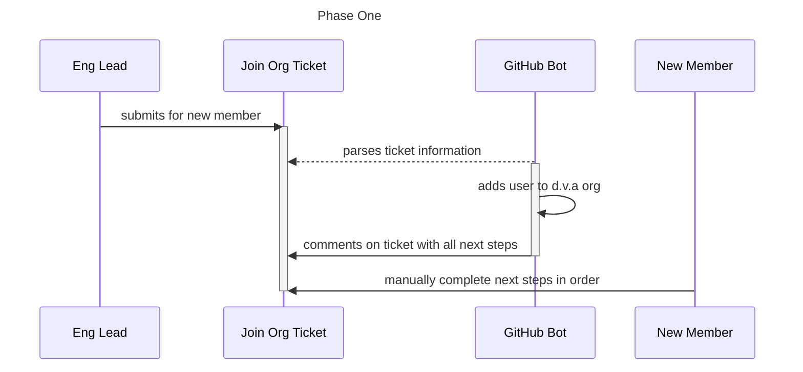
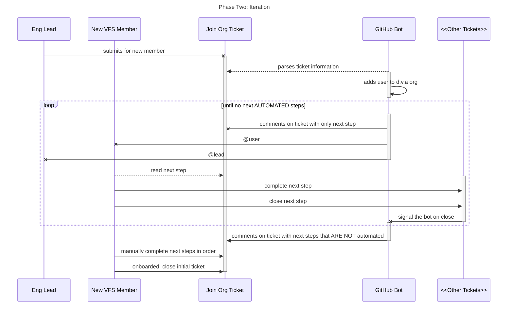
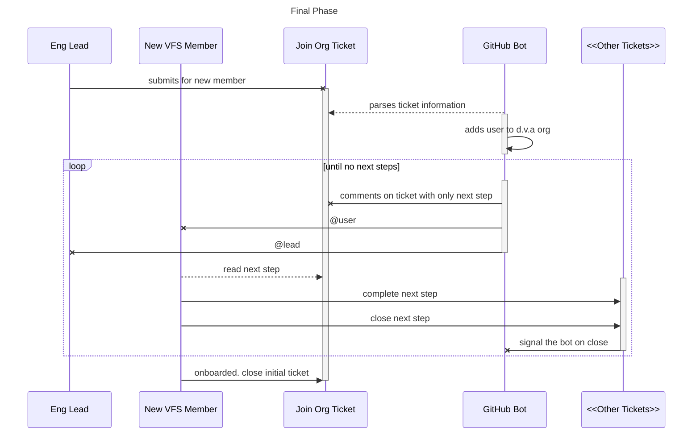

# RFC: VFS New Hire Onboarding Automation will be Coordinated through a Single GitHub Issue

* Comment Deadline: `2022-08-17`
* Team Crew and Name: Platform/Access Management Spike Team
* Authors:
  * [Kevin Duensing](https://github.com/kjduensing)

## Background
Currently, VFS user onboarding involves a several GitHub issue requests and coordination between
platform teams. It is largely up to the newly-joining VFS team member to track their own progress
through the onboarding process. The Governance team has a wealth of information in the Platform
Orientation ticket [link]() and the Infrastructure team does an excellent job of guiding users
through troubleshooting issues. However, the newly-hired VFS team member will benefit from an
automated and stepwise process coordinated in a single GitHub issue request. 

## Motivation
We're providing a single coordination point from which a newly-hired VFS team member can conduct all their
onboarding activities requested through GitHub. This will make the onboarding process more
digestible and more transparent, as well as reducing the workload of the platform teams supporting
onboarding.

## Design
### Phase One: Coordinate
In our research, we identified that one of the onboarding pain points is that it falls on the user to understand what step is next and where they are in the process. The Platform Orientation ticket does an excellent job of describing the next steps, and we're excited to leverage that ticket in our Phase One. However, there are a few steps that need to be completed before a user can submit a platform orientation ticket. This phase will help organize and coordinate those extra steps, while providing visibility into the onboarding process.

### Phase Two: Iterate

### Final State

## Risks
There are few risks with this phased, incremental approach. It enables our automation to make an impact quickly, but also allows us to iteratively increase the impact of the automation.

However, no solution is without risk. With this solution (and with any automated process), discovering and automating edge cases could increase the scope of the automation far beyond its initial use case. Since we are using a single GitHub issue to coordinate a VFS user's onboarding journey, the issue has the potential to grow to include fields, comments, and automation that is outside the bounds of what it is intended for. Care must be taken to provide a process for handling edge cases without increasing the scope of the automation or the GitHub issue unnecessarily. 

## Alternatives
One alternative is to use the GitHub issues "as is", and not attempt to coordinate the onboarding journey in a single ticket. We could simply link the disparate tickets together with some automation. 
 