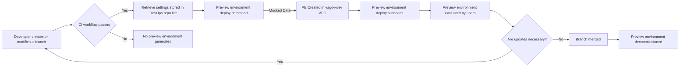

# RFC: The Preview environment architecture will generate publicly accessible environments hosted in EKS using mocked test data.

* Comment Deadline: `2022-12-15`
* Team Crew and Name: Platform/Tech Team 4
* Authors:
  * [pjhill](https://github.com/pjhill)
  * [JoeTice](https://github.com/JoeTice)
* [Original RFC Pull Request](https://github.com/department-of-veterans-affairs/va.gov-platform-arch/pull/51)

## Background
Review Instances is the term used for the current approach to the ephemeral environments used on the VA.gov platform. Review instances provide many helpful capabilities to preview products on the platform, but have also been the source of negative feedback from VFS teams over recent quarters. Between platform feedback surveys and recent discovery efforts, a list of pain points was surfaced and is listed below...
1. VFS team members & VA Stakeholders without SOCKS access or the technical knowledge to use SOCKS can't use review instances
2. Review Instance creation operates under the deprecated BRD (build, release, deploy) paradigm
3. Review Instances don't always spin up reliably
4. Review Instances are only available for a limited time, and therefore aren't available when needed
5. VFS team members are unable to preview changes from multiple sources in a single preview environment
6. VFS Teams are unclear on the benefits and intended use of Review Instances
7. VFS team members are unable to reach review instances with tools hosted in the cloud
8. Review Instances can't be tested on real or virtual mobile devices

As a result of these issues, review instance usage is low. Review Instances are generated for every PR that is created. As of 11/18/2022, less than 10% of the review instances that are automatically created are ever accessed by a user.

## Motivation
This proposed architecture change will provide a solution to enable VFS teams to effectively preview new code and features on their products more easily and effectively, while also eliminating or mitigating all known pain points of previous solution, listed above.

The new architecture, known as Preview Environments, will provide VFS teams with a capability that allows greater customization and the ability to determine for themselves what they need to effectively preview changes and collaborate with their teams.

## Design
Based on discovery, we determined there were different use cases desired from different teams. This raised the need for allowing VFS developers more control in setting up their ephemeral environment, while keeping the ability to utilize those environments as accessible as possible to facilitate internal testing, stakeholder reviews, and user testing with veterans.

For the MVP of the preview environment architecture, the user will interact with GitHub normally and the preview environment will be created with default settings. As a developer pushes their branch to `vets-website` or `vets-api`, the preview environment architecture will detect the branch and begin the process of deploying the code in the branch to a preview environment. Once the continuous integration workflow completes successfully, a request to deploy the preview environment triggers a GitHub Actions workflow. The GHA workflow writes the dynamically generated preview environment configuration to the `app-manifest` repository. EKS detects the change in the `devops` repository and deploys the newly defined environment.

A diagram is submitted [below](#Diagrams) as additional explanation.

**MVP Feature Set:**
1. Preview Environment MVP will create ephemeral environments that can be accessed without SOCKS
2. Preview Environment MVP will operate on the EKS infrastructure and paradigm
3. Preview Environment MVP will automatically create a Preview Environment when a PR is created
4. Preview Environment MVP will utilize mock test data

### Post-MVP Design: Additional Features
For reference, there are numerous additional features planned for inclusion in Post-MVP iterations. Specifically, we will begin adding the abilities to specify custom settings like: custom repository configurations, selection of different types of test data, connectivity to lower environment endpoints for external partners. These features will be vetted and prioritized as development progresses.

### Access controls
For the MVP, we do not expect to require access controls for the publicly available preview environments. The default and only configuration available to users excludes the integration of preview environments with external services operated by other groups within the VA, so our assumption is that it is acceptable to allow public access to these preview environments. For the post MVP implementation that permits users to potentially configure a preview environment that integrates with external services, we plan to either --
1. Create the PE in a way that requires the user to use CAG, VPN, or SOCKS to access it
2. Direct the user to a landing page that uses GitHub Oauth to authenticate the user

## Risks
* Removing the ability for a preview environment to integrate with VA enterprise lower environments may initially reduce the quality of the experience of preview environments for some users. These risks will lessen over time as additional functionality is added into preview environments and this capability is restored.
* If there is an overlap between the creation of review instances and the creation of preview environments there could be increased resource usage and cost while both products are supported.
* In order to operate preview.va.gov as the DNS for preview environements, we will need to create or modify an ESECC request declaring our intent for a public route and asking for the VA to configure a portion of the route for us. If one of the following assumptions is not true it may extend the time it takes to resolve the issue of establishing a publicly accessible route to preview environments. We are assuming several things in order to make this happen --
    1. We will be able to submit the existing WASA scan of VA.gov with the new ESECC request.
    2. We should use the existing RFC 965 that seeks to define all public addresses used by the VA.gov Platform team.
* We are assuming that for the post-MVP we will be able to route traffic from within a Platform operated VPC to external services operated elsewhere within the VA enterprise. If it is not possible to route traffic from within the VAGov* VPCs then it may not be possible in the post-MVP efforts to integrate preview environments with external services hosted elsewhere within the VA enterprise.
    
<!--
List the risks of this approach

* There are always risks. What are the risks of this solution?
* These are the things people will bring up in opposition to your idea or plans. Acknowledge them.
-->
## Alternatives
There were a number of approaches explored during Discovery, listed first below is the recommended approach, followed by the two other primary solutions considered. Lastly, we included a feature comparison to inform everyone on what led into our decision making process.

### Custom preview environment build process: (Selected Approach)
A custom process that is initiated by events in GitHub, built by GitHub Actions, and orchestrated by EKS. The capabilities with a custom solution are limited by few characteristics of the existing tech stack. Known limitations within the technologies available for our custom solution are that GitHub API limits the number of requests we can make, EKS will only operate within certain VPCs, and creating a new subdomain for use with preview environments may be a lengthy process.

### GitHub Codespaces:
Codespaces is billed by GitHub as a "dev environment in the cloud." While Codespaces does create development environments, the primary purpose of these development environments is focused around coding and controlling the creation of reproducible development environments for the purposes of collaboration between developers and the facilitation of onboarding new developers. Projecting the solution beyond MVP, Codespaces does not support potential key future features. Although Codespaces does produce public ephemeral previews, support for addtiional use cases beyond the MVP scope of this project will not be supported easily or at all. Given that Codespaces hosting is not configurable beyond general machine specification, it will not be possible to integrate Codespace instances with other VA services outside of the VA.gov instance. It will not be possible to model the Codespace deployment identically to the production deployment. Nor will it be possible to promote the ephemeral environment deployed by Codespaces to production.

### TugboatQA:
Data-first testing and review environments within a mighty serverless platform. The CMS team operates an "on-prem" version of Tugboat. This means that Tugboat environments have easy access to other VA enterprise resources. Tugboat is a product built specifically for creating ephemeral environments for the purpose of testing and demoing.

### Summary of Alternative Capabilities
Below is a summary of the key capabilities necessary to create the product that resolves the pain points uncovered during discovery.

|                                     | Custom | Codespaces | TugboatQA |
|-------------------------------------|--------|------------|-----------|
| Publicly accessible                 | Yes    | Yes        | No        |
| Uses new EKS paradigm               | Yes    | No         | No        |
| Promote environment                 | Yes    | No         | No        |
| Removes SOCKS                       | Yes    | Yes        | No        |
| User specified resource versions    | Yes    | Yes        | Yes       |
| Integrate with VA enterprise lowers | Yes    | No         | Yes       |
| Customize settings                  | Yes    | Yes        | Yes       |
| Mocked data                         | Yes    | Yes        | Yes       |
| Test harnesses                      | Yes    | Yes        | Yes       |

## Diagrams

### Workflow Diagram

The in progress diagram link is [here](https://mermaid.live/edit#pako:eNp9kl9v2jAUxb_KlZ82KSAISUkyaRP_2jKtFHXTpBX64MYXsEjsyHbCssB3n2PotErd8mTZ93fOyb23IalkSBKyyeQh3VFl4MvDh7UA-41WU6wwkwUqSBVSgxqkglwyvuH2TOFZUZHunqDT-QjjZjKHg1T7VgkKqjXq01lo7AqOP1AfYbJ6QKO4FQaNxnCx1aCNVMiAC7CG94UGhYWEDc_w6ZXAQh7hcbWQUCisOB4ARcWVFDkKA4v7b7BFgcrmZBdu4rjpavlGPcMikzWkMs-peAGmZ6M7me5toCk19Aizd8sZTNz_u4wV3cqqw7CC78vJ-zM3c9z1_4x0maaITF-crh1x8yaBFc1KZ_dcQ6lRvUA3DrptRgqhLJibiMAUtaaq_nTp9u1f3R69umr7N1-N3dAgR7X906i5K_j8j_xtj7jWXAoLEI9YNKec2a1pWnxNzA5zXJPEHhlV-zVZi5Oto6WRX2uRksSoEj1yjjzldKtoTpINzbS9Rcbt_O_Oa-i20SMFFSRpyE-SdOJh2A37vSgMo6Hf6_Ujj9QkCYZR14_jQXAVxlHgh1fBySO_pLSy_e4wHAyCuB8FcRTHfuw7vUf32AY5_QbD2_TA).

### Network Diagram
Note: Gray objects and arrows represent post-MVP work

