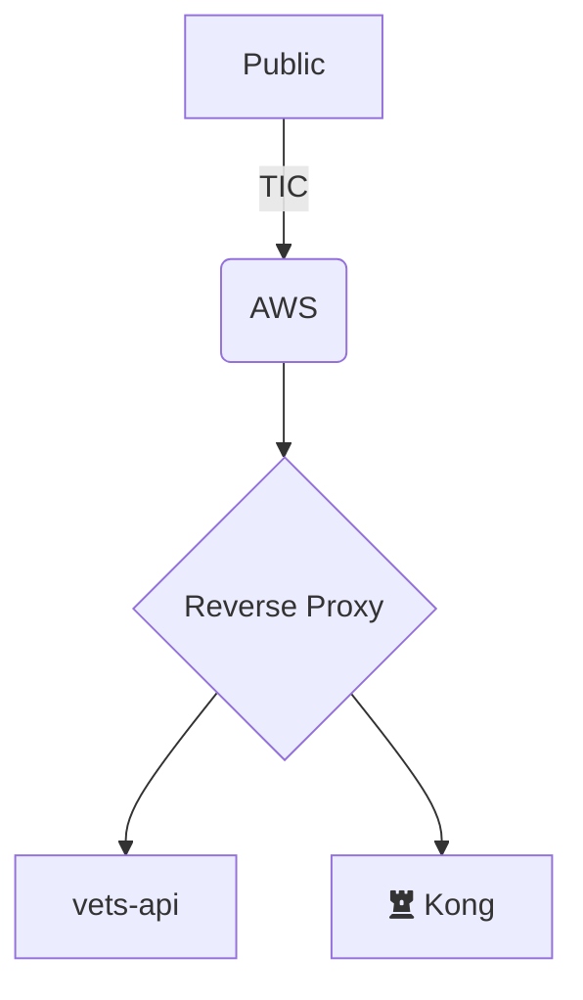

# RFC: The Preview Environment architecture will generate publicly accessible environments hosted in EKS using mocked test data.

<!--
The title is what you want comments on. Use the active voice in a future tense.
Example:
    - The website will be built using the XZY framework
-->

* Comment Deadline: `2022-12-09`
* Team Crew and Name: Platform Tech Team 4<!--e.g. Platform/AMT-->
* Authors:
  * [pjhill](https://github.com/pjhill)
  * [JoeTice](https://github.com/JoeTice)
* [Original RFC Pull Request](https://github.com/department-of-veterans-affairs/va.gov-platform-arch/pull/-1)

## Background
The current version of ephemeral environments for use on the VA.gov platform is referred to as Review Instances. Review instances provide many capabilities, but several characteristics of review instances cause pain points.
1. Review instance creation operates under the deprecated BRD (build, release, deploy) paradigm
2. VFS teams without SOCKS or the technical knowledge to use SOCKS can't use review instances
3. VA Stakeholders without SOCKS or the technical knowledge to use SOCKS can't use review instances
4. VFS teams are unable to reach review instances with tools hosted in the cloud
5. VFS teams are unable to preview changes from multiple sources in a single preview environment

As a result, review instance usage is fairly low. Over the past two weeks (as of 11/2/2022) approximately 15% of the review instances that get created are ever accessed by a user.

## Motivation

The Preview Environment Architecture change is intended to update the create of preview environments to the new EKS deployment strategy, reduce or remove the impact of the listed pain points, and increase VFS team use of the ephemeral environments that are created.

The EKS hosting paradigm for ephemeral environments enables preview environments to spin up more quickly, produce more consistent user experiences upon interaction with the environments, and enable greater customizability for each environment.

## Design
TBD

<!--Explain the proposed design in enough detail so that a team member will fully understand the implementation. Include a diagram (in the `images` dir) as needed to convey your plans. Use active voice, present tense, and decisive language. -->

## Risks
TBD

<!--
List the risks of this approach

* There are always risks. What are the risks of this solution?
* These are the things people will bring up in opposition to your idea or plans. Acknowledge them.
-->
## Alternatives
1. Custom preview environment build process driven by events in GitHub, built by GitHub Actions, and orchestrated by EKS.
2. Codespaces --brief description--
3. TugboatQA --brief description--

List the alternative approaches

* There are always alternatives. What other alternative solutions were considered? Not considered?
* What are their strengths, weaknesses, risks? Why weren’t they chosen?
* Do not allow bias of a solution to show in this section, ensure each alternative has been considering seriously or do not list it in this section

## Diagrams

Try to visually represent the proposal using a [diagram](https://docs.github.com/en/get-started/writing-on-github/working-with-advanced-formatting/creating-diagrams). [Live editor](https://mermaid.live/)

## References

<!--
This section /may/ be eliminated if it is not applicable.
When linking to other documents in this repository, ensure to link to their state at a particular commit (hence the usage of .../blob/<FULL_COMMIT_HASH>/...) as opposed to their current state (i.e. 'currently in main').
-->

* [RFC XYZ](https://github.com/department-of-veterans-affairs/va.gov-platform-arch/blob/<FULL_COMMIT_HASH>/rfc/<FILENAME>.md): <RFC_TITLE>

