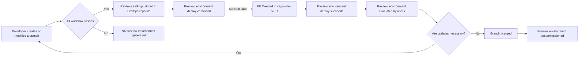

# RFC: The Preview environment architecture will generate publicly accessible environments hosted in EKS using mocked test data.

* Comment Deadline: `2022-12-15`
* Team Crew and Name: Platform/Tech Team 4
* Authors:
  * [pjhill](https://github.com/pjhill)
  * [JoeTice](https://github.com/JoeTice)
* [Original RFC Pull Request](https://github.com/department-of-veterans-affairs/va.gov-platform-arch/pull/-1)

## Background
The current version of ephemeral environments for use on the VA.gov platform is referred to as Review Instances. Review instances provide many capabilities, but several characteristics of review instances cause pain points.
1. Review instance creation operates under the deprecated BRD (build, release, deploy) paradigm
2. VFS team members without SOCKS access or the technical knowledge to use SOCKS can't use review instances
3. VA stakeholders without SOCKS access or the technical knowledge to use SOCKS can't use review instances
4. VFS team members are unable to reach review instances with tools hosted in the cloud
5. VFS team members are unable to preview changes from multiple sources in a single preview environment
6. Review Instances don't always spin up reliably
7. Review Instances aren't available when needed, and the timeframe can't be adjusted
8. VFS Teams are unclear on the benefits and intended use of Review Instances
9. Review Instances can't be tested on real or virtual mobile devices

As a result, review instance usage is fairly low. As of 11/14/2022, less than 10% of the review instances that are automatically created are ever accessed by a user.

## Motivation

The preview environment architecture change is intended to update the creation of preview environments to the new EKS deployment strategy, reduce or remove the impact of the listed pain points, and increase VFS team use of the ephemeral environments that are created.

The EKS hosting paradigm for ephemeral environments enables preview environments to spin up more quickly, produce more consistent user experiences upon interaction with the environments, and enable greater customizability for each environment. Additionally, moving this platform process to the new EKS paradigm reduces the breadth and complexity of the infrastructure code that Platform needs to maintain in order to operate successfully.

## Design
For the MVP of the preview environment architecture, the user will interact solely with GitHub and the preview environment will be created with default settings. As a developer pushes their branch to `vets-website` or `vets-api`, the preview environment architecture will detect the branch and begin the process of deploying the code in the branch to a preview environment. Once the continuous integration workflow completes successfully, a request to deploy the preview environment triggers a GitHub Actions workflow. The GHA workflow writes the dynamically generated preview environment configuration to the `app-manifest` repository. EKS detects the change in the `devops` repository and deploys the newly defined environment.

A diagram is submitted [below](#Diagrams) as additional explanation.

### Post-MVP Design: Additional Features
There are a number of additional features planned to include in Post-MVP iterations. Specifically, we will begin adding the abilities to specify custom settings, including custom repository configurations, different types and sets of test data, and allowing custom durations to be set for a Preview Environment.

## Risks
* Removing the ability for a preview environment to integrate with VA enterprise lower environments may reduce the quality of the experience of preview environments for some users.
* If there is an overlap between the existence of review instances and preview environments there could be increased resource usage and cost while both products need to be supported.

<!--
List the risks of this approach

* There are always risks. What are the risks of this solution?
* These are the things people will bring up in opposition to your idea or plans. Acknowledge them.
-->
## Alternatives
### Custom preview environment build process:
A custom process that is driven by events in GitHub, built by GitHub Actions, and orchestrated by EKS. The capabilities with a custom solution are limited by few characteristics of the existing tech stack. In working through what might be possible, we know that GitHub API limits the number of requests we can make, EKS will only operate within certain VPCs, 

### GitHub Codespaces:
Codespaces is billed by GitHub as a "dev environment in the cloud." While Codespaces does create development environments, the primary purpose of these development environments is focused around coding and controlling the creation of reproducible development environments for the purposes of collaboration between developers and the facilitation of onboarding new developers.

### TugboatQA:
Data-first testing and review environments within a mighty serverless platform. The CMS team operates an "on-prem" version of Tugboat. This means that Tugboat environments have easy access to other VA enterprise resources. Tugboat is a product built specifically for creating ephemeral environments for the purpose of testing and demoing.

### Summary of Alternative Capabilities
Below is a summary of the key capabilities necessary to create the product that resolves the pain points uncovered during discovery.

|                                     | Custom | Codespaces | TugboatQA |
|-------------------------------------|--------|------------|-----------|
| Publicly accessible                 | Yes    | Yes        | No        |
| Uses new EKS paradigm               | Yes    | No         | No        |
| Promote environment                 | Yes    | No         | No        |
| Removes SOCKS                       | Yes    | Yes        | No        |
| User specified resource versions    | Yes    | Yes        | Yes       |
| Integrate with VA enterprise lowers | Yes    | No         | Yes       |
| Customize settings                  | Yes    | Yes        | Yes       |
| Mocked data                         | Yes    | Yes        | Yes       |
| Test harnesses                      | Yes    | Yes        | Yes       |

## Diagrams
The in progress diagram link is [here](https://mermaid.live/edit#pako:eNp9kl9v2jAUxb_KlZ82KSAISUkyaRP_2jKtFHXTpBX64MYXsEjsyHbCssB3n2PotErd8mTZ93fOyb23IalkSBKyyeQh3VFl4MvDh7UA-41WU6wwkwUqSBVSgxqkglwyvuH2TOFZUZHunqDT-QjjZjKHg1T7VgkKqjXq01lo7AqOP1AfYbJ6QKO4FQaNxnCx1aCNVMiAC7CG94UGhYWEDc_w6ZXAQh7hcbWQUCisOB4ARcWVFDkKA4v7b7BFgcrmZBdu4rjpavlGPcMikzWkMs-peAGmZ6M7me5toCk19Aizd8sZTNz_u4wV3cqqw7CC78vJ-zM3c9z1_4x0maaITF-crh1x8yaBFc1KZ_dcQ6lRvUA3DrptRgqhLJibiMAUtaaq_nTp9u1f3R69umr7N1-N3dAgR7X906i5K_j8j_xtj7jWXAoLEI9YNKec2a1pWnxNzA5zXJPEHhlV-zVZi5Oto6WRX2uRksSoEj1yjjzldKtoTpINzbS9Rcbt_O_Oa-i20SMFFSRpyE-SdOJh2A37vSgMo6Hf6_Ujj9QkCYZR14_jQXAVxlHgh1fBySO_pLSy_e4wHAyCuB8FcRTHfuw7vUf32AY5_QbD2_TA).

