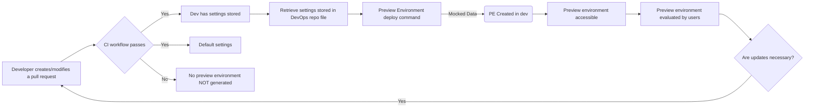

# RFC: The Preview environment architecture will generate publicly accessible environments hosted in EKS using mocked test data.

* Comment Deadline: `2022-12-15`
* Team Crew and Name: Platform/Tech Team 4
* Authors:
  * [pjhill](https://github.com/pjhill)
  * [JoeTice](https://github.com/JoeTice)
* [Original RFC Pull Request](https://github.com/department-of-veterans-affairs/va.gov-platform-arch/pull/-1)

## Background
The current version of ephemeral environments for use on the VA.gov platform is referred to as Review Instances. Review instances provide many capabilities, but several characteristics of review instances cause pain points.
1. Review instance creation operates under the deprecated BRD (build, release, deploy) paradigm
2. VFS team members without SOCKS access or the technical knowledge to use SOCKS can't use review instances
3. VA stakeholders without SOCKS access or the technical knowledge to use SOCKS can't use review instances
4. VFS team members are unable to reach review instances with tools hosted in the cloud
5. VFS team members are unable to preview changes from multiple sources in a single preview environment
6. Review Instances don't always spin up reliably
7. Review Instances aren't available when needed, and the timeframe can't be adjusted
8. VFS Teams are unclear on the benefits and intended use of Review Instances
9. Review Instances can't be tested on real or virtual mobile devices

As a result, review instance usage is fairly low. As of 11/14/2022, less than 10% of the review instances that are automatically created are ever accessed by a user.

## Motivation

The preview environment architecture change is intended to update the creation of preview environments to the new EKS deployment strategy, reduce or remove the impact of the listed pain points, and increase VFS team use of the ephemeral environments that are created.

The EKS hosting paradigm for ephemeral environments enables preview environments to spin up more quickly, produce more consistent user experiences upon interaction with the environments, and enable greater customizability for each environment. Additionally, moving this platform process to the new EKS paradigm reduces the breadth and complexity of the infrastructure code that Platform needs to maintain in order to operate successfully.

## Design
For the MVP of the preview environment architecture, the user will interact solely with GitHub and the preview environment will be created with default settings. As a developer pushes their branch to GitHub, the preview environment architecture will detect the branch and begin the process of deploying the code in the branch to a preview environment. Once the continuous integration workflow completes successfully, a request to deploy the preview environment triggers a GitHub Actions workflow. The GHA workflow writes the dynamically generated preview environment configuration to the `devops` repository. EKS detects the change in the `devops` repository and deploys the newly defined environment.

A diagram is submitted [below](#Diagrams) as additional explanation.

## Risks
TBD

<!--
List the risks of this approach

* There are always risks. What are the risks of this solution?
* These are the things people will bring up in opposition to your idea or plans. Acknowledge them.
-->
## Alternatives
* Custom preview environment build process driven by events in GitHub, built by GitHub Actions, and orchestrated by EKS.
  * Supported aspects of Platform use cases: 
    * Ability to make an environment public
    * Removes reliance on BRD infrastructure paradigm
    * Removes requirement for SOCKS in order to access the environment
    * Ability to define specific versions of additional resources
    * Able to integrate with VA lower environments
    * Ability to customize the preview environment
    * Support for mocking integrations / test data
    * Ability to promote preview environment
    * Ability to orchestrate deployments with EKS
* GitHub Codespaces : Codespaces is billed by GitHub as a "dev environment in the cloud." While Codespaces does create development environments, the primary purpose of these development environments is focused around coding and controlling the creation of reproducible development environments for the purposes of collaboration between developers and the facilitation of onboarding new developers.
  * Supported aspects of Platform use cases:
    * Access control for environments
    * Ability to make an environment public
    * Removes reliance on BRD infrastructure paradigm
    * Removes requirement for SOCKS in order to access the environment
    * Ability to define specific versions of additional resources
  * Unsupported aspects of Platform use cases:
    * Unable to integrate with VA enterprise lower environments
    * Unable to directly promote a preview environment
    * Unable to orchestrate deployments with EKS
* TugboatQA : Data-first testing and review environments within a mighty serverless platform. The CMS team operates an "on-prem" version of Tugboat. This means that Tugboat environments have easy access to other VA enterprise resources. Tugboat is a product built specifically for creating ephemeral environments for the purpose of testing and demoing .
  * Supported aspects of Platform use cases:
    * Able to integrate with VA lower environments
    * Removes reliance on BRD infrastructure paradigm
    * Ability to customize the preview environment
    * Support for mocking integrations / test data
    * Ability to use different version of different resources
  * Unsupported aspects of Platform use cases:
    * Current on-prem solution requries SOCKS access
    * Unable to directly promote a development environment
    * Unable to orchestrate deployments with EKS

## Diagrams
The in progress diagram link is [here](https://mermaid.live/edit#pako:eNptkl9v2jAUxb_KlZ9WKWUhJDRk0iYKqF1LadXuZSV9cJMbsEjszHbCGPDd5ziA2J88WfHvnnPu9d2SRKRIIpLlYp0sqdQwff4UczDfcD7GGnNRooREItWoPhYiZRlDBRTKKs9B4o8KlX6Dy8vPcL0dfYW1kKtGDEqqFKp9q3Vtgd13VDsYNbqwpAoUas34why0kJi-_cuODZvRKtcn9k9oJnbwOp8JKCXWDNeAvGZS8AK5htnjN1ggR2miH8VHtm4yf0YtmWnv7wzAOJh4j6UyvZUCMpbjoXRiS2_mTweryZlVimUuNpCIoqD86HXTZnwQycoIj6mmO7j98DSBkZ2m9UqxvmjpW0vfneTPO6FJgkqx91OWOwvf_xfGmuaV1X_fQKVQHmd2b4um26FEqMq0eVDg2ChTuflyeKnp2fSHxCEFyoKy1KzItgFiopdYYEwic0ypXMUk5nvD0UqLlw1PSKRlhQ5pDcaMLiQtSJTRXJm_mDIz5od25-zqOaSknERb8pNE_X4nDILeled2w8Dr-w7ZkMgPB50r1x8EA8_1u70w3DvklxBG0-2E_W7P83y33w181_MGVuzVXjYp9r8BAkntJg).

## References

<!--
This section /may/ be eliminated if it is not applicable.
When linking to other documents in this repository, ensure to link to their state at a particular commit (hence the usage of .../blob/<FULL_COMMIT_HASH>/...) as opposed to their current state (i.e. 'currently in main').
-->

* [RFC XYZ](https://github.com/department-of-veterans-affairs/va.gov-platform-arch/blob/<FULL_COMMIT_HASH>/rfc/<FILENAME>.md): <RFC_TITLE>

