# RFC: PEP will migrate from App Pod into Traefik Ingress

* Comment Deadline: `2023-02-02`
* Team Crew and Name: Platform/TT1
* Authors:
  * [Igor Yegorov](https://github.com/considerable)
  * [Rachal Cassity](https://github.com/RachalCassity)
  * [Lindsey Hattamer](https://github.com/LindseySaari)
  * [Lainey Trahan](https://github.com/laineymajor)
* [Original RFC Pull Request](https://github.com/department-of-veterans-affairs/va.gov-platform-arch/pull/-1)

## Background

Zero trust network access (ZTNA) is a set of products and services that create an identity- and context-based, logical-access boundary that encompass an enterprise user and an internally hosted application or set of applications. The applications are hidden from discovery, and access is restricted via a Policy Enforcement Point (PEP) or Trust Broker to a collection of named entities. ZTNA removes excessive implicit trust that often accompanies other forms of application access, such as legacy VPN. 

Platform Vets-API is transitioning from a monolith application in "Build, Release, Deploy System" (BRD) into a set of microservices in Elastic Kubernetes Service (EKS), a system partially managed by Amazon.

At the same time, Platform networking is transitioning from legacy location-based security into identity-aware ZTNA.

## Motivation

Transitioning to microservices has many advantages for teams building large applications that must accelerate the pace of innovation, deployments and time to market. It also provides them the opportunity to secure their applications and services better than they did with monolithic codebases. 

Zero-trust security provides technology teams with a scalable way to make security fool-proof while managing a growing number of microservices and greater complexity. That’s right—and although it seems counterintuitive at first—with microservices, we now have the opportunity to secure our applications and all of their services better than we ever did with monolithic codebases. Failure to do so will result in non-secure, exploitable and non-compliant architectures that are only going to become more difficult to secure in the future.

## Design

### 1. Legacy BRD: The monolith implements its own PEP and custom logging solution.

### 2. Future EKS: TraefikEE, a ZTA PEP, talks OIDC to SSO. Logging is structured. SIEM is integrated.

 

## Acronyms: 

- **PEP** - Policy Enforcement Point, a system entity that requests and subsequently enforces authorization decisions
- **TIC** - Trusted Internet Connection coming from VA firewall
- **RevProxy** - OpenResty, an enhanced version of Nginx core. Public endpoint routing and SSL termination is done there.
- **MS** - Microservice, a simple app in EKS
- **Kong** - (Temporary) API gateway. The Lighthouse team has developed a staged migration plan to replace the Kong API gateway in AWS with an Apigee API gateway in the Google Cloud Platform (GCP).
- **Traefik** - Traefik Community Edition
- **TraefikEE** - Traefik Enterprise Edition
- **OIDC** - OpenID Connect 
- **SSO** - Single Sign-On

## Risks

* The proposed design assigns the role of ZTNA identity-aware proxy to the Kubernetes Ingress controller Traefik Enterprise Edition.   
Since this role is very critical in terms of security and reliability, it is important to have 24/7 customer support from a networking vendor such as Traefik Labs.
* A paid version of the system (Traefik Enterprise) is also required for the OpenID Connect (OIDC) middleware to work with the Single Sign-On (SSO) authentication and authorization.
* People will also bring the budget questions and FedRamp certification questions for an infrastructure vendor, such as Traefik Enterprise or f5 NGINX Enterprise. Acknowledging that there is room for such questions, we also acknowledge that a ZTNA-compliant Kubernetes Ingress controller such as NGINX Enterprise or Traefik Enterprise carries the responsibilities of an old-times corporate firewall. It might be prudent to have a networking security and performance vendor, i.e. f5 or Traefik Labs, supporting ZTNA Kubernetes Ingress appliance 24/7 full-time, as the opposite of a temporary software development team managing it part-time.

## Alternatives

The memorandum M-22-09 sets forth a Federal zero trust architecture (ZTA) strategy, requiring agencies to meet specific cybersecurity standards. Due to the current regulation, there is no alternative to ZTA.

### What is Traefik and what are its top alternatives?

Traefik integrates with your existing infrastructure components and configures itself automatically and **dynamically**.
Traefik is a tool in a tech stack's Load Balancer / Reverse Proxy category, open-source software with GitHub stars and GitHub forks. 

Vanilla Kubernetes provides many useful features for service discovery and load balancing, including Services and cluster DNS, a LoadBalancer primitive, and more. Also, Kubernetes Services can be exposed to the outside world using the NodePort service type. However, Kubernetes lacks a comprehensive system for routing traffic inside the cluster, defining domains and subdomains, configuring complex ingress and redirection rules, traffic splitting, rate limiting, and other useful traffic management features.

You’ll need an ingress controller or edge router with reverse proxy functionality to implement these features. One of the best solutions for Kubernetes is Traefik, which calls itself “a leading modern reverse proxy and load balancer that makes deploying microservices easy.”

Traefik can be configured to route traffic from entry points (e.g., URLs) to specific services in your Kubernetes cluster. In contrast to a traditional reverse proxy, Traefik employs services discovery to **dynamically** configure itself from the Kubernetes services.

When traffic reaches the cluster, Traefik can apply middleware to transform requests. You can use Traefik middleware to modify headers, set up authentication, redirect requests, or configure a request rate limit. Middleware can also be used to configure circuit breakers and automatic retries.

The below table compares Traefik Ingress Controller to its top alternatives:

| | f5 NGINX	| Kong | Traefik |	HAproxy |
|:---|:---|:---|:---|:---|
|Supported Protocols | http/https, http2, grpc, tcp/udp | http/https, http2, grpc, tcp (l4) | http/https, http2 (h2c), grpc, tcp, tcp+tls | http/https, http2, grpc, tcp, tcp+tls |
| Built upon | nginx/nginx plus | nginx | traefik | haproxy |
| Routing logic | host, path, header, method, query param (all with regex expect host) | host, path, method, header * | host (regex), path (regex), headers (regex), query, path prefix, method | host, path |
| Scope | Cluster or specified namespaces | Specified namespace | Cluster or specified namespaces	 | Cluster or specified namespaces |
| Load balancing Algorithms | round-robin, least-conn, ip-hash, hash, random, least-time\*, sticky sessions\* | weighted-round-robin, sticky sessions | weighted-round-robin, dynamic-round-robin, sticky sessions | round-robin, static-rr, leastconn, first, source, uri, url_param, header, sticky sessions |
| Authentication Protocols	| Basic, Client cert, external | Basic, external OAuth | Basic, HMAC, Key, LDAP, OAuth 2.0, PASETO, **OpenID Connect** **	 | Basic, auth-url, auth-tls, external auth | Basic, OAuth, Auth TLS |
| Graphical User Interface | Yes * ** | Yes * ** | Yes | No |
| Request Tracing | Yes | Yes | Yes | No |
| 24/7 Technical Support | Yes * | Yes * | Yes * | Yes * |

\* Enterprise/paid edition only

\** Module has to be installed

## References

* f5 NGINX Blog: [Seven Guidelines for Implementing Zero Trust in Kubernetes](https://www.nginx.com/blog/seven-guidelines-implementing-zero-trust-in-kubernetes/)
* Kong HQ Blog: [The Importance of Zero-Trust Security When Making the Microservices Move](https://konghq.com/blog/the-importance-of-zero-trust-security-when-making-the-microservices-move)
* Traefik Blog: [JWT and Traefik Enterprise](https://traefik.io/blog/announcing-traefik-enterprise-2-9/)
* HAProxy Blog: [Verify OAuth JWT Tokens with HAProxy](https://www.haproxy.com/blog/verify-oauth-jwt-tokens-with-haproxy/)
* Kubevious Blog: [Comparing Top Ingress Controllers For Kubernetes](https://kubevious.io/blog/post/comparing-top-ingress-controllers-for-kubernetes)
* IET RFC 002: [TraefikEE + Keycloak SSO on Kubernetes Ingress](https://github.com/department-of-veterans-affairs/va.gov-platform-architecture/blob/main/rfc/2022/2022-06-15_IET_002_TraefikEE-Keycloak-SSO-on-Kubernetes-Ingress.md)
* The White House: [Memorandum M-22-09](https://www.whitehouse.gov/wp-content/uploads/2022/01/M-22-09.pdf)
* NIST: [Publication SP 800-207](https://csrc.nist.gov/publications/detail/sp/800-207/final)
* DoD: [CNAP Reference Design](https://dodcio.defense.gov/Portals/0/Documents/Library/CNAP_RefDesign_v1.0.pdf)
* Datadog: [Detect application abuse and fraud with Datadog Cloud SIEM](https://www.datadoghq.com/blog/detect-abuse-of-functionality-with-datadog/)
