# RFC: PEP will migrate from App Pod to EKS Ingress Controller

* Comment Deadline: `2023-02-02`
* Team Crew and Name: Platform/TT1
* Authors:
  * [Igor Yegorov](https://github.com/considerable)
  * [Lainey Trahan](https://github.com/laineymajor)
  * [Lindsey Hattamer](https://github.com/LindseySaari)
  * [Rachal Cassity](https://github.com/RachalCassity)
  * [Rebecca Tolmach](https://github.com/rmtolmach)
* [Original RFC Pull Request](https://github.com/department-of-veterans-affairs/va.gov-platform-architecture/pull/52)

## Background

Zero trust network access (ZTNA) is a set of products and services that create an identity- and context-based, logical-access boundary that encompass an enterprise user and an internally hosted application or set of applications. The applications are hidden from discovery, and access is restricted via a Policy Enforcement Point (PEP) or Trust Broker to a collection of named entities. ZTNA removes excessive implicit trust that often accompanies other forms of application access, such as legacy SOCKS/VPN.

With legacy network solutions based on SOCKS/VPN, authenticated users implicitly gain access to everything on the same subnet. Only a password prevents unauthorized users from accessing a resource. ZTNA flips that paradigm. Users can only “see” the specific applications and resources explicitly permitted by their company’s security policy.

Platform Vets-API is transitioning from a monolith application in the "Build, Release, Deploy" (BRD) system ran in virtual machines of Elastic Cloud (EC2) Amazon service into a set of microservice containers ran in Pods of Elastic Kubernetes Service (EKS), an open-source system for automating deployment, scaling, and management of containerized applications, partially managed by Amazon.

Platform networking is also transitioning from legacy location-based (implicit trust) security into identity-aware ZTNA (explicit trust).

Diagram 1. Transitioning EKS security from SOCKS/VPN into ZTNA explicit trust by combining Ingress Controller and PEP functions. 

Legend:

* SOCKS/VPN - legacy location-based SocketSecurity (SOCKS) or Virtual Private Network (VPN).
* Kubernetes Ingress - exposes HTTP and HTTPS routes from outside the cluster to services within the cluster.
* MS - Microservice. Compared to a typical Rails/Node.js app, it has a narrow scope and focuses on doing smaller tasks well. 
* PEP - Policy Enforcement Point, a system entity that requests and subsequently enforces authorization decisions.
* Discovery - the initial step system administrators (and bad actors alike) take when they want to map and monitor the network.

## Motivation

Zero-trust security provides technology teams with a scalable way to make security fool-proof while managing a growing number of microservices and greater complexity. Although it seems counterintuitive at first - with the PEP on the Ingress Controller in front of EKS microservices, we now have the opportunity to secure our applications and all of their services better than we ever did with monolithic codebases. Failure to do so will result in non-secure, exploitable and non-compliant architectures that are only going to become more difficult to secure in the future.

## Design

Diagrams 2 and 3 below demonstrate the transition of PEP from Pod-level to Ingress-level inside the EKS Vets-API network.

Diagram 2. Legacy BRD - the monolith implements its own PEP and custom logging solution.

Legend:

* Public - web requests originated from a public internet location, such as a Veteran's computer.
* TIC - Trusted Internet Connection device aka main VA firewall.
* NGINX RevProxy - SSL termination device for public web requests.
* BRD VM PEP - legacy BRD system VM also acting as PEP for old Vets-API.
* Old SSOe - the legacy single sign-on system that was used to broker with ID.me, etc.
* Private - web requests coming from an associate private location via SOCKS/VPN, such as a Developer's workstation.
* Kong - (Temporary) API gateway. The Lighthouse team has developed a staged migration plan to replace the Kong API gateway in AWS with an Apigee API gateway in the Google Cloud Platform (GCP).
* Traefik - current EKS Ingress Controller in use for the newly emerging containerized Vets-API microservices. 
* MS...Pod PEP - Microservices, such as Vets-API, Sidekiq-UI, etc. with their specific PEP implementations.
* GitHub OAuth Apps - single sign-on technique for teams.
* Basic Auth - authentication technique for apps if any.

Diagram 3 below removes the burden of PEP programming from the microservices. The critical role of PEP is also removed from the microservices and put in front of the EKS network - in the Ingress Controller which can be the current Traefik Community Edition or some other alternative such as Traefik Enterprise Edition or Cognito/AWS Load Balancer Controller. Other elements of Zero Trust Architecture such as SIEM and AI/ML on Diagram 3 are not yet implemented and are only brought here for reference. 

Diagram 3. Future EKS - Ingress Controller is acting as PEP. Logging is unified. SIEM and AI/ML are planned.

Legend:

* Green boxes representing new Singn In Service (SiS):
  - SiS for Veterans, a broker to Login.gov and alike;
  - SiS for Teams, a successor to GitHub OAuth Apps technique;
  - SiS for Apps, a solution for service accounts in machine-to-machine API calls.
* Ingress Controller PEP - either current Traefik or an alternative Controller to assume the PEP role.
* Datadog Cloud SIEM - an offering from the current logging vendor to consider for a managed Security Information and Event Management (SIEM) role, a network security component required by ZTA.
* AI/ML Behavior Analytics - Artificial Intelligence or Machine Learning solution for user Behavior Analytics that is yet to be designed as it is required by ZTA for the more distant future.
* Adaptive MFA - additional factors for Authentication based on user history as prescribed by ZTA.    
The current implementation of Platform SiS already has Adaptive MFA capabilities.

## Risks

* The proposed design assigns the role of ZTNA identity-aware proxy to the Kubernetes Ingress Controller, Traefik or an alternative.   
Since this role is very critical in terms of security and reliability, it is important to have 24/7 customer support from a networking vendor such as Traefik Labs, f5, or Amazon.
* A paid version of the system (Traefik Enterprise) is also required for the OpenID Connect (OIDC) middleware to work with the Single Sign-On (SSO) authentication and authorization.
* People will also bring the budget questions and FedRamp certification questions for an infrastructure vendor and their product, such as Traefik Enterprise, f5 NGINX Enterprise, Cognito/AWS Load Balancer Controller. Acknowledging that there is room for such questions, we also acknowledge that a ZTNA-compliant Kubernetes Ingress controller carries the responsibilities of an old-times corporate firewall. It might be prudent to have a networking security and performance vendor, i.e. f5, or Traefik Labs, or Amazon, supporting ZTNA Kubernetes Ingress appliance 24/7 full-time, as the opposite of a temporary software development team managing it part-time.
* It is best to use strong authentication to lessen the risk that SOCKS proxies turn non-compliant with ZTNA.
* If not a full PEP-protected EKS network, at least password protection for SOCKS is required.      
SOCKS-5 Proxy is the latest SOCKS protocol with enhanced security. It has three types of authentication methods to research and mitigate the risk of non-authorized access to the SOCKS service of VA:
  - Null authentication — which means no authentication is required to connect to a proxy.
  - Username or password authentication- which means you need private login details to connect to a proxy.
  - GSS-API authentication – Both you and the server use authentication methods at the OS level to verify your identity.

## Alternatives

The memorandum M-22-09 sets forth a Federal zero trust architecture (ZTA) strategy, requiring agencies to meet specific cybersecurity standards. Due to the current regulation, there is no alternative to ZTA.

### What is Traefik and what are its top alternatives?

Traefik integrates with your existing infrastructure components and configures itself automatically and **dynamically**.
Traefik is a tool in a tech stack's Load Balancer / Reverse Proxy category, open-source software with GitHub stars and GitHub forks. 

Vanilla Kubernetes provides many useful features for service discovery and load balancing, including Services and cluster DNS, a LoadBalancer primitive, and more. Also, Kubernetes Services can be exposed to the outside world using the NodePort service type. However, Kubernetes lacks a comprehensive system for routing traffic inside the cluster, defining domains and subdomains, configuring complex ingress and redirection rules, traffic splitting, rate limiting, and other useful traffic management features.

You’ll need an ingress controller or edge router with reverse proxy functionality to implement these features. One of the best solutions for Kubernetes is Traefik, which calls itself “a leading modern reverse proxy and load balancer that makes deploying microservices easy.”

Traefik can be configured to route traffic from entry points (e.g., URLs) to specific services in your Kubernetes cluster. In contrast to a traditional reverse proxy, Traefik employs services discovery to **dynamically** configure itself from the Kubernetes services.

When traffic reaches the cluster, Traefik can apply middleware to transform requests. You can use Traefik middleware to modify headers, set up authentication, redirect requests, or configure a request rate limit. Middleware can also be used to configure circuit breakers and automatic retries.

The below table compares Traefik Ingress Controller to its top alternatives:

| | f5 NGINX	| Kong | Traefik |	Cognito/AWS Load Balancer Controller |
|:---|:---|:---|:---|:---|
|Supported Protocols | http/https, http2, grpc, tcp/udp | http/https, http2, grpc, tcp (l4) | http/https, http2 (h2c), grpc, tcp, tcp+tls | http/https, grpc, tcp, udp, tls |
| Built upon | nginx/nginx plus | nginx | traefik | AWS Load Balancer Controller |
| Routing logic | host, path, header, method, query param (all with regex expect host) | host, path, method, header * | host (regex), path (regex), headers (regex), query, path prefix, method | host, path, header, method, query, ip, regex |
| Scope | Cluster or specified namespaces | Specified namespace | Cluster or specified namespaces	 | Cluster or specified namespaces |
| Load balancing Algorithms | round-robin, least-conn, ip-hash, hash, random, least-time\*, sticky sessions\* | weighted-round-robin, sticky sessions | weighted-round-robin, dynamic-round-robin, sticky sessions | round-robin (RR), least outstanding requests (LOR)  |
| Authentication Protocols	| Basic, Client cert, external | Basic, external OAuth | Basic, HMAC, Key, LDAP, OAuth 2.0, PASETO, **OpenID Connect** **	 | **OpenID Connect** |
| Graphical User Interface | Yes * ** | Yes * ** | Yes | Yes |
| Request Tracing | Yes | Yes | Yes | Yes |
| 24/7 Technical Support | Yes * | Yes * | Yes * | Yes * |

\* Enterprise/paid edition only

\** Module has to be installed

## References

##### 1. High-level:

* WH Memorandum: [M-22-09 (January 2022) Moving the U.S. Government Toward Zero Trust Cybersecurity Principles](https://www.whitehouse.gov/wp-content/uploads/2022/01/M-22-09.pdf)
* NIST Special Publication: [SP 800-207 (August 2020) Zero Trust Architecture](https://csrc.nist.gov/publications/detail/sp/800-207/final)
* NIST Special Publication: [SP 1800-35B (July 2022) Implementing a Zero Trust Architecture]()
* DoD Reference Design (RD): [RD (July 2021) Cloud Native Access Point (CNAP)](https://dodcio.defense.gov/Portals/0/Documents/Library/CNAP_RefDesign_v1.0.pdf)
* VA Platform: [GitHub issue (October 2022) EKS security considerations next steps #48791](https://github.com/department-of-veterans-affairs/va.gov-team/issues/48791)

##### 2. Hands-on:

* f5 NGINX Blog: [Seven Guidelines for Implementing Zero Trust in Kubernetes](https://www.nginx.com/blog/seven-guidelines-implementing-zero-trust-in-kubernetes/)
* Kong HQ Blog: [The Importance of Zero-Trust Security When Making the Microservices Move](https://konghq.com/blog/the-importance-of-zero-trust-security-when-making-the-microservices-move)
* Traefik Blog: [JWT and Traefik Enterprise](https://traefik.io/blog/announcing-traefik-enterprise-2-9/)
* Amazon Blog: [How to use Application Load Balancer and Amazon Cognito to authenticate users for your Kubernetes web apps](https://aws.amazon.com/blogs/containers/how-to-use-application-load-balancer-and-amazon-cognito-to-authenticate-users-for-your-kubernetes-web-apps/)
* IET RFC 002: [TraefikEE + Keycloak SSO on Kubernetes Ingress](https://github.com/department-of-veterans-affairs/va.gov-platform-architecture/blob/main/rfc/2022/2022-06-15_IET_002_TraefikEE-Keycloak-SSO-on-Kubernetes-Ingress.md)
* Datadog: [Detect application abuse and fraud with Datadog Cloud SIEM](https://www.datadoghq.com/blog/detect-abuse-of-functionality-with-datadog/)
* GoogleCloudPlatform demo: [Online Boutique](https://github.com/GoogleCloudPlatform/microservices-demo/blob/main/README.md), a demo Kubernetes app composed of 11 microservices written in different languages
* Security Intelligence Article: [What is SOCKS Proxy Exploit](https://securityintelligence.com/articles/what-is-socks-proxy-exploit/)
* DZone Security Article: [SOCKS5 Proxy and its Benefits](https://dzone.com/articles/what-is-socks5-proxy-and-the-benefits-associated-w)
