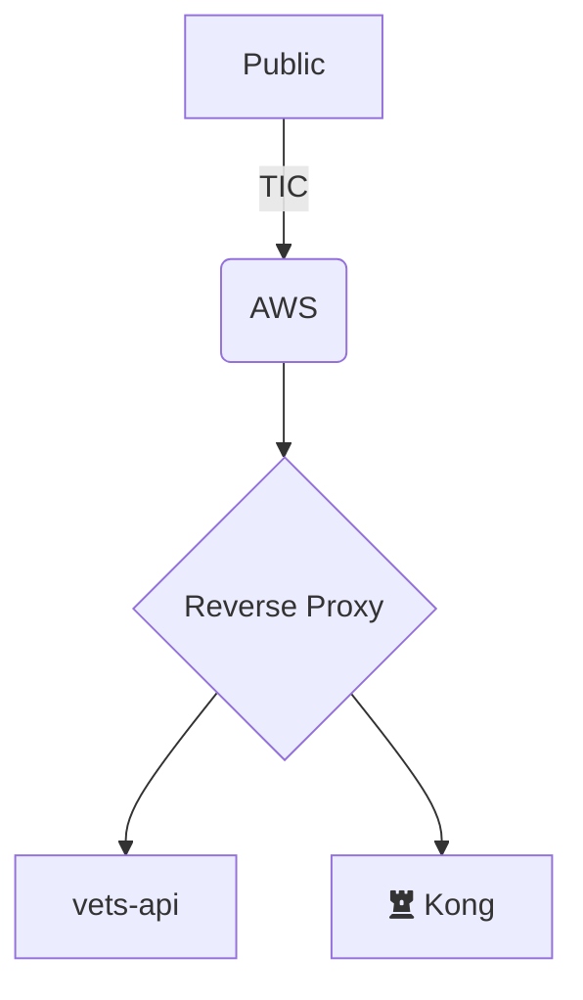

# RFC: VFS teams shall monitor performance and gradually adopt performance budgets

<!--
The title is what you want comments on. Use the active voice in a future tense.
Example:
    - The website will be built using the XZY framework
-->

* Comment Deadline: `2023-06-10`
* Team Crew and Name: <!--e.g. Platform/AMT-->
* Authors:
  * [@dcloud](https://github.com/dcloud)
  * [Contributing Author 1 Github Handle](https://github.com/ContributingAuthor1Handle)
  * [Contributing Author 2 Github Handle](https://github.com/ContributingAuthor2Handle)
* [Original RFC Pull Request](https://github.com/department-of-veterans-affairs/va.gov-platform-arch/pull/-1)

## Background

> Explain the current state. What is the problem? What needs to happen? Provide enough background for someone new to the problem space to understand this decision. Use active voice, present tense, and decisive language.
> Example: We need to choose how the website will render in the browser. There are several competing frameworks to choose from.

Currently, VA.gov frontend pages perform poorly for a significant number of Veterans. In late 2022, 48.35% of users to va.gov were on relatively slow mobile devices (Source: Google Analytics, 7/26/22-8/01/22). A significant amount are also on slow third-party devices, such as library desktops, per [government research](https://docs.fcc.gov/public/attachments/DOC-357270A1.pdf). Automated reports on the [Frontend support dashboard](https://department-of-veterans-affairs.github.io/veteran-facing-services-tools/frontend-support-dashboard/lighthouse-performance-report/) and in Datadog via [RUM's Core Web Vitals](https://docs.datadoghq.com/real_user_monitoring/browser/monitoring_page_performance/#core-web-vitals) show us that many pages on VA.gov perform poorly for Veterans. We need to optimize VA.gov frontend applications for better performance.

Performance affects people's experience with websites, and poor performance can prevent people from using a website. For Veterans, this can affect whether they can access the services they need online. However, [industry research shows](https://infrequently.org/2022/12/performance-baseline-2023/) how we can budget for better, more equitable performance. We should follow this guidance and adopt practices that help us improve how our web applications perform for all Veterans.

## Motivation

>Which problem(s) does this solve? Why? Use active voice, present tense, and decisive language.
> Example: Framework XYZ is a modern, well-known, web rendering framework. It is easy to learn, easy to use, and provides high-performance web rendering. etc

Datadog and Google Lighthouse help us understand the Veteran experience with VA.gov by measuring frontend performance. The information provided can help teams identify how to improve website performance for Veterans using various devices and internet connection speeds. These measurements can also help teams define and adopt a budget for how much HTML, CSS and JavaScript should be served per application and per pageview.

We can address many challenges to frontend performance on VA.gov today. Every performance report on the [Frontend Performance Dashboard](https://department-of-veterans-affairs.github.io/veteran-facing-services-tools/frontend-support-dashboard/lighthouse-performance-report/) links to a "Treemap", a visualization of what JavaScript libraries and components are included and estimates for how much is unused or duplicated. For example, the treemap for the [Va.gov homepage's report](https://vetsgov-website-builds-s3-upload-test.s3-us-gov-west-1.amazonaws.com/lighthouse/homepage.html) shows that of 3.59MB of JavaScript, 1.55MB, or about 43% is *unused*.

Further digging into existing performance reports, it appears that most, if not all, pages have three JavaScript bundles, and each bundle has its own copy of React. It appears that **pages have multiple redundant copies of the same code libraries**. In part, this is due to pages including `web-components.entry.js` (508.752 KiB) and `vendor.entry.js` (349.064 KiB) in addition to an application-specific bundle. The tools we use today can [prevent this duplication](https://webpack.js.org/guides/code-splitting/#prevent-duplication).

A sample of performance scores is available below under [Performance Scores](#performance-scores)

## Design

> Explain the proposed design in enough detail so that a team member will fully understand the implementation. Include a diagram (in the `images` dir) as needed to convey your plans. Use active voice, present tense, and decisive language.

The Platform should provide general guidance and technical resources to empower VFS teams to adopt performance budgets. Providing access to Datadog's RUM is a first step that will give teams information about performance via Core Web Vitals, which can help them come up with performance budget targets. Teams are already in the process of gaining access to Datadog, and adding RUM to measure Core Web Vitals is a reasonable next step.

Sitewide performance issues can be addressed to improve performance across VA.gov applications. The **shared header and footer** are React applications that are part of the `static-pages.entry.js` bundle, which is 1.397MB as of April 2023. The header and footer should be refactored to remove React and use build-time generated HTML, with lightweight web components to add interactivity and manage accessibility. Improving performance of the header and footer will have a positive impact across VA.gov and subdomains that inject the header and footer.

Another step is to update the [Frontend Support Dashboard - Performance Report](https://department-of-veterans-affairs.github.io/veteran-facing-services-tools/frontend-support-dashboard/lighthouse-performance-report/) to include all applications. This will raise visibility of performance issues, both per application and sitewide. This step will also help teams remember to review those reports periodically, this will also help teams understand where their applications experience performance issues.

["The Performance Inequality Gap," 2023](https://infrequently.org/2022/12/performance-baseline-2023/) suggests file size limits for HTML, CSS, and JavaScript, e.g. "~151KiB of HTML/CSS/fonts and ~300-350KiB of JavaScript (gzipped)". Using that report as a guide, we can determine reasonable file size limits and include them in our own performance budgets. VFS teams would use these baselines, along with the information about their application's real world performance provided by Datadog RUM and the Performance Report dashboard, to manage performance budgets for their applications.

As mentioned above, we can leverage our existing build tool, Webpack, to [prevent duplication](https://webpack.js.org/guides/code-splitting/#prevent-duplication) of code, removing the multiple copies of the same libraries in bundles. Webpack also provides options for [notifying teams of performance issues](https://webpack.js.org/configuration/performance/), another way to help teams understand performance and adopt a budget.

## Risks

>List the risks of this approach
> * There are always risks. What are the risks of this solution?
> * These are the things people will bring up in opposition to your idea or plans. Acknowledge them.

- There are large assets on the page such as Google Analytics and Digital Voice scripts that we cannot optimize or remove. Performance budgets can and should acknowledge this.
- Removing duplicate scripts can create dependencies between bundles. Given our Webpack configuration already injects "shared modules", this dependency is already expected, we're just missing the de-duplication step.
- Applications may require lots of refactoring to reach a performance budget goal, or teams may simply not have a lot of time to work on performance. Budgets can be adopted gradually, and process created for customizing budgets and allowing exceptions when there are significant barriers to increasing performance.
- Teams may need help improving performance. We can adopt a "we're all in this together" approach and empower teams to help each other
- This could be perceived as a Platform responsibility. If VFS teams are empowered to make or propose improvements, this work can and should be shared across VFS and Platform teams.
- People may question the data informing this proposal. The VA-specific research mentioned is from 2019, and broadband adoption has likely changed since then. The guidance provided by "The Performance Inequality Gap" is based on global measures, not US or Veteran-specific measures. We could spend time gathering more data on the performance experiences of VA.gov users.

## Alternatives

> List the alternative approaches
> * There are always alternatives. What other alternative solutions were considered? Not considered?
> * What are their strengths, weaknesses, risks? Why weren’t they chosen?
> * Do not allow bias of a solution to show in this section, ensure each alternative has been considering seriously or do not list it in this section

One alternative would be to adopt an hypermedia-centric approach and have `vets-api` generate HTML documents and "partials" in coordination with a lightweight hypertext-centric framework such as [htmx](https://htmx.org), a ~14KiB JavaScript library. This would shift a lot of logic to the server and minimize the amount of JavaScript, the major contributor to the performance issues facing VA.gov. This would represent a paradigm shift in how VA.gov applications are built, and require a significant investment in time and resources to adopt across all applications. This shift could be done incrementally, but still represents a major architectural change.

Another alternative to adopting performance budgets at this time is to do more research on the issue of performance before adopting any corrective measures. We'd want to gather and analyze metrics and talk to Veterans about what their experience with VA.gov applications is. We certainly should gather and analyze information regardless of any improvements, but it seems reasonable to predict that some number of Veterans are experiencing poor performance based on the data at hand.

## Diagrams

Try to visually represent the proposal using a [diagram](https://docs.github.com/en/get-started/writing-on-github/working-with-advanced-formatting/creating-diagrams). [Live editor](https://mermaid.live/)

## Performance Scores

The following table samples performance scores, as of 10 May 2023, from the [Frontend Performance Dashboard](https://department-of-veterans-affairs.github.io/veteran-facing-services-tools/frontend-support-dashboard/lighthouse-performance-report/):

| label                             | performance | finalUrl                                                                                                                       | notes |
|-----------------------------------|-------------|--------------------------------------------------------------------------------------------------------------------------------|-------|
| appeals                           | 18%         | https://www.va.gov/decision-reviews/board-appeal/request-board-appeal-form-10182                                               |       |
| auth                              | 19%         | https://www.va.gov/auth/login/callback                                                                                         |       |
| burials                           | 9%          | https://www.va.gov/burials-and-memorials/application/530                                                                       |       |
| caregivers                        | 15%         | https://www.va.gov/family-member-benefits/apply-for-caregiver-assistance-form-10-10cg                                          |       |
| check-in                          | 16%         | https://www.va.gov/health-care/appointment-check-in                                                                            |       |
| claims-status                     | 6%          | https://www.va.gov/?next=%2Ftrack-claims                                                                                       |       |
| coronavirus-research              | 14%         | https://www.va.gov/coronavirus-research/volunteer                                                                              |       |
| coronavirus-screener              | 14%         | https://www.va.gov/covid19screen                                                                                               |       |
| coronavirus-vaccination           | 23%         | https://www.va.gov/health-care/covid-19-vaccine/                                                                               |       |
| coronavirus-vaccination-expansion | 15%         | https://www.va.gov/health-care/covid-19-vaccine/                                                                               |       |
| debt-letters                      | 11%         | https://www.va.gov/manage-va-debt/request-debt-help-form-5655/                                                                 |       |
| debt-letters                      | 16%         | https://www.va.gov/manage-va-debt/                                                                                             |       |
| disability-benefits               | 14%         | https://www.va.gov/decision-reviews/higher-level-review/request-higher-level-review-form-20-0996                               |       |
| disability-benefits               | 11%         | https://www.va.gov/disability/file-disability-claim-form-21-526ez                                                              |       |
| disability-benefits               | 11%         | https://www.va.gov/view-change-dependents/add-remove-form-21-686c                                                              |       |
| disability-benefits/2346          | 14%         | https://www.va.gov/health-care/order-hearing-aid-batteries-and-accessories/order-form-2346/                                    |       |
| discharge-wizard                  | 24%         | https://www.va.gov/discharge-upgrade-instructions                                                                              |       |
| edu-benefits                      | 15%         | https://www.va.gov/education/about-gi-bill-benefits/how-to-use-benefits/vettec-high-tech-program/apply-for-vettec-form-22-0994 |       |
| edu-benefits                      | 11%         | https://www.va.gov/education/apply-for-education-benefits/application/1990                                                     |       |
| edu-benefits                      | 12%         | https://www.va.gov/education/apply-for-education-benefits/application/1990E                                                    |       |
| edu-benefits                      | 30%         | https://www.va.gov/education/other-va-education-benefits/national-call-to-service-program/                                     |       |
| edu-benefits                      | 12%         | https://www.va.gov/education/apply-for-education-benefits/application/1995                                                     |       |
| edu-benefits                      | 9%          | https://www.va.gov/education/apply-for-education-benefits/application/5490                                                     |       |
| edu-benefits                      | 20%         | https://www.va.gov/education/apply-for-education-benefits/application/5495                                                     |       |
| edu-benefits                      | 10%         | https://www.va.gov/education/opt-out-information-sharing/opt-out-form-0993                                                     |       |
| edu-benefits                      | 16%         | https://www.va.gov/education/other-va-education-benefits/stem-scholarship/apply-for-scholarship-form-22-10203                  |       |
| edu-benefits                      | 22%         | https://www.va.gov/education/other-va-education-benefits/                                                                      |       |
| edu-benefits                      | 22%         | https://www.va.gov/education/submit-school-feedback                                                                            |       |
| facility-locator                  | 17%         | https://www.va.gov/find-locations                                                                                              |       |
| gi                                | 9%          | https://www.va.gov/education/gi-bill-comparison-tool/                                                                          |       |
| hca                               | 10%         | https://www.va.gov/health-care/apply/application                                                                               |       |
| homepage                          | 24%         | https://www.va.gov/                                                                                                            |       |
| login                             | 8%          | https://www.va.gov/sign-in/                                                                                                    |       |
| medical-copays                    | 14%         | https://www.va.gov/health-care/pay-copay-bill/                                                                                 |       |
| pensions                          | 11%         | https://www.va.gov/pension/application/527EZ                                                                                   |       |
| personalization                   | 7%          | https://www.va.gov/?next=%2Fview-change-dependents%2Fview                                                                      |       |
| pre-need                          | 10%         | https://www.va.gov/burials-and-memorials/pre-need/form-10007-apply-for-eligibility                                             |       |
| resources-and-support             | 15%         | https://www.va.gov/resources/                                                                                                  |       |
| search                            | 26%         | https://www.va.gov/search/                                                                                                     |       |
| static-pages                      | 10%         | https://www.va.gov/careers-employment/vocational-rehabilitation/apply-vre-form-28-1900                                         |       |
| terms-and-conditions              | 12%         | https://www.va.gov/health-care/medical-information-terms-conditions/                                                           |       |
| vaos                              | 7%          | https://www.va.gov/?next=%2Fhealth-care%2Fschedule-view-va-appointments%2Fappointments                                         |       |
| verify                            | 4%          | https://www.va.gov/                                                                                                            |       |
| vre                               | 9%          | https://www.va.gov/careers-employment/education-and-career-counseling/apply-career-guidance-form-28-8832                       |       |
| yellow-ribbon                     | 20%         | https://www.va.gov/education/yellow-ribbon-participating-schools/                                                              |       |

_Note_: The set of applications is limited by what is available on the performance dashboard, as well as by issues accessing the machine-readable versions of the reports. This is not an exhaustive accounting of all VA.gov Frontend applications, but a significant sample.

## References

<!--
This section /may/ be eliminated if it is not applicable.
When linking to other documents in this repository, ensure to link to their state at a particular commit (hence the usage of .../blob/<FULL_COMMIT_HASH>/...) as opposed to their current state (i.e. 'currently in main').
-->

- [Core Web Vitals as a UX measure](https://web.dev/vitals/)
- [Performance Budgets 101](https://web.dev/performance-budgets-101/)
- [Webpack Performance Features](https://webpack.js.org/configuration/performance/)
- [Designing for Performance: Performance is User Experience](https://designingforperformance.com/performance-is-ux/)
- [The Performance Inequality Gap, 2023](https://infrequently.org/2022/12/performance-baseline-2023/)
- [Report on Promoting Broadband Internet Access Service for Veterans, Pursuant to the Repack Airwaves Yielding Better Access for Users of Modern Services Act of 2018 (PDF)](https://docs.fcc.gov/public/attachments/DOC-357270A1.pdf)
- VA.gov | Client application documentation's [Frontend Performance Dashboard](https://department-of-veterans-affairs.github.io/veteran-facing-services-tools/frontend-support-dashboard/lighthouse-performance-report/)
