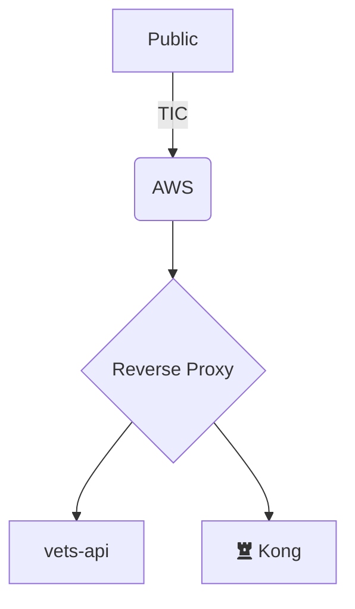

# RFC: _decision statement_

<!--
The title is what you want comments on. Use the active voice in a future tense.
Example:
    - The website will be built using the XZY framework
-->

* Comment Deadline: `YYYY-MM-DD`
* Team Crew and Name: <!--e.g. Platform/AMT-->
* Authors:
  * [Primary Author Github Handle](https://github.com/PrimaryAuthorHandle)
  * [Contributing Author 1 Github Handle](https://github.com/ContributingAuthor1Handle)
  * [Contributing Author 2 Github Handle](https://github.com/ContributingAuthor2Handle)
* [Original RFC Pull Request](https://github.com/department-of-veterans-affairs/va.gov-platform-arch/pull/-1)

## Background

Explain the current state. What is the problem? What needs to happen? Provide enough background for someone new to the problem space to understand this decision. Use active voice, present tense, and decisive language.
Example: We need to choose how the website will render in the browser. There are several competing frameworks to choose from.

## Motivation

Which problem(s) does this solve? Why? Use active voice, present tense, and decisive language.
Example: Framework XYZ is a modern, well-known, web rendering framework. It is easy to learn, easy to use, and provides high-performance web rendering. etc

## Design

Explain the proposed design in enough detail so that a team member will fully understand the implementation. Include a diagram (in the `images` dir) as needed to convey your plans. Use active voice, present tense, and decisive language.

## Risks

List the risks of this approach

* There are always risks. What are the risks of this solution?
* These are the things people will bring up in opposition to your idea or plans. Acknowledge them.

## Alternatives

List the alternative approaches

* There are always alternatives. What other alternative solutions were considered? Not considered?
* What are their strengths, weaknesses, risks? Why weren’t they chosen?
* Do not allow bias of a solution to show in this section, ensure each alternative has been considering seriously or do not list it in this section

## Diagrams

Try to visually represent the proposal using a [diagram](https://docs.github.com/en/get-started/writing-on-github/working-with-advanced-formatting/creating-diagrams). [Live editor](https://mermaid.live/)

## References

<!--
This section /may/ be eliminated if it is not applicable.
When linking to other documents in this repository, ensure to link to their state at a particular commit (hence the usage of .../blob/<FULL_COMMIT_HASH>/...) as opposed to their current state (i.e. 'currently in main').
-->

* [RFC XYZ](https://github.com/department-of-veterans-affairs/va.gov-platform-arch/blob/<FULL_COMMIT_HASH>/rfc/<FILENAME>.md): <RFC_TITLE>

